Filecoin’s first RetroPGF round ("FIL RetroPGF 1") [concluded](https://docs.google.com/spreadsheets/d/15tQZU4yfzCCso_dd5NGXfSy6XB2pmrEZzZrG_TEIKyY/edit#gid=1610641018) last week, awarding nearly 200,000 FIL to 99 (out of 106 eligible) projects.

For a full discussion of the results, I strongly recommend reading [Kiran Karra’s article for CryptoEconLab](https://medium.com/cryptoeconlab/a-deepdive-into-fil-retropgf-1-results-7e5a0bcdba08). It also includes some excellent data visualizations as well as links to raw data and anonymized voting results.

This post will explore the results from a different angle and look specifically at three aspects:

1. How the round compared to Optimism’s most recent round (RetroPGF3)
2. How impact was presented to badgeholders
3. How open source software impact was rewarded by badgeholders

It will conclude with some brief thoughts on how metrics can help with evaluation in future RetroPGF rounds.

As always, you can view the analysis notebooks [here](https://github.com/opensource-observer/insights/tree/main/analysis/filecoin/fil_retropgf) and run your own analysis using Open Source Observer data by going [here](https://docs.opensource.observer/docs/get-started/). If you want additional context for how the round was run, check out the complete Notion guide [here](https://fil-retropgf.notion.site/FIL-RetroPGF-4b6f5358440043c8bb1bf53f0297541e).

<!-- truncate -->

## How the round compared to Optimism’s most recent round (RetroPGF3)

One of the most striking observations is that the distribution of FIL across projects was very flat. There wasn’t a huge difference in funding between a median impact project and a high impact project.

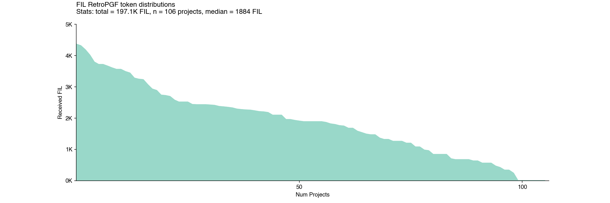

Indeed, the top project – [GLIF Nodes & RPC API](https://www.fil-retropgf.io/projects/0x005bcf117de0884513333371a7061d3cc87ea946c4b8507063a0fb8c26879b63) – received 4365 FIL, only about two times more than a median project like [Filemarket](https://www.fil-retropgf.io/projects/0xceb238d2abdfe413a919b6aefefed19b605ce604a2580d4d858608f836ffb67b), which received 1925 FIL.

We call this type of distribution a [peanut butter spread](https://gov.gitcoin.co/t/long-tail-public-goods-funding/17318): relatively even with some chunks here and there.

Overall, this was a much flatter distribution than Optimism’s in RetroPGF3 (see below). Also note that RetroPGF3 was considerably flatter than Optimism’s RetroPGF2.

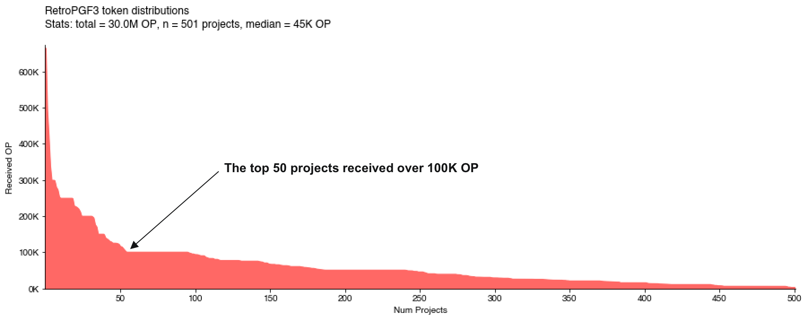

There also wasn’t much variation by impact category. For instance, “tooling” and “community / education” were two of the most popular categories, with 30+ submissions each, but had very similar distribution curves and median allocations.

Here is the “community / education” distribution.

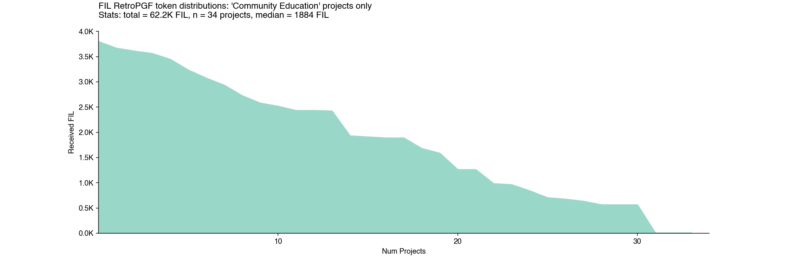

And here is the “tooling” distribution.

As [Kiran noted in his post](https://medium.com/cryptoeconlab/a-deepdive-into-fil-retropgf-1-results-7e5a0bcdba08), “infrastructure” was the only category where projects tended to receive larger allocations.

However, within “infrastructure”, the distribution appears just as flat as the other categories. This implies that badgeholders preferred infrastructure projects in general as opposed to just a few specific projects that lifted up the median for the category.

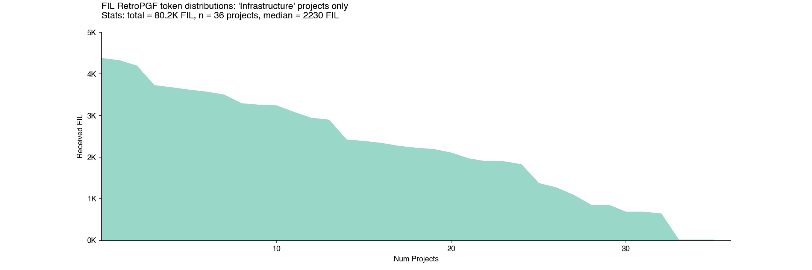

By comparison, in the Optimism round, there was much greater variation by theme. Core infrastructure and developer libraries were heavily rewarded, but there was less funding for education and onchain applications.

This outcome may be partly due to the round mechanics. Each badgeholder had 100 votes to award across their preferred set of projects. There were a total of 751 non-zero votes and a median value of 2. Virtually every project got a lot of 1s, 2s, and 3s – and very few projects got votes above 10, as can be seen in the chart below. There were also several projects that did well in the ranking despite having relatively few votes overall (eg, IPFSNEWS.CN and “Farcaster”).

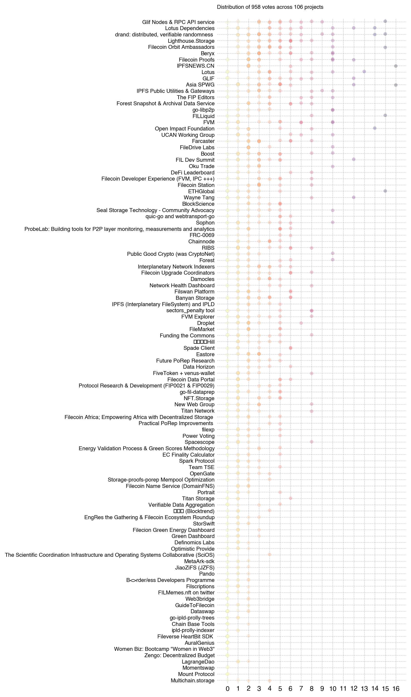

## How impact was presented to badgeholders

In the RetroPGF application, projects had the opportunity to include links to document their contributions and impact on the ecosystem. In total, there were 886 links included in project applications.

GitHub links were by far the most common – over 300. The next closest was Twitter with 45 links. Beyond these two sources, there was a very long tail of links that included everything from block explorers to Google Docs.

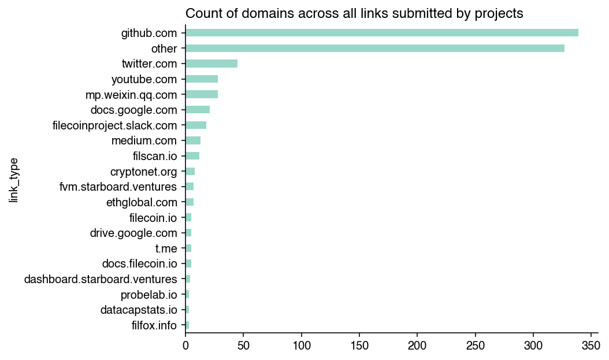

We can also look at the same data at a project level. There were 75 projects that included a GitHub link, followed by 20 that included a Twitter link, and then a variety of project-specific links.

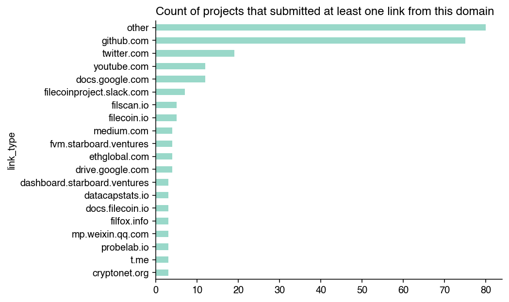

Given the variety of external link types, there’s not much we can extract to make systematic comparisons among projects. Instead, these links served more as a supplement to the narrative sections of the project application. In my view, the lack of comparable, verifiable data about projects was a shortcoming of the round.

The one exception, of course, is the GitHub data, which we will explore in the next section.

## How open source software impact was rewarded by badgeholders

There were 75 projects that included a link to some form of GitHub-related impact. From this pool, Open Source Observer identified 60 applications that pointed to a standalone repository, organization, or group of related repos that could be tied to a project or team.

Projects with at least one GitHub link in their application tended to perform better than projects that didn’t have any GitHub links. The 60 projects verified by OSO received a median of 2093 FIL (versus 1465 FIL) for the remaining 46 projects that were not on OSO.

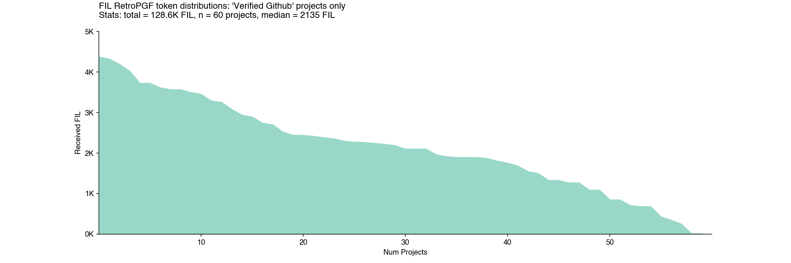

Some projects, like IPNI and nft.storage, include links that made their impact traceable to a single GitHub org space. Some, like Forest and Beryx, had their impact traceable to a single GitHub repo within their org space.

There were also projects that had their impact traceable to multiple org spaces OR to a space that was being claimed by a separate applicant. For instance, repos including filecoin-project/fips, filecoin-project/lotus, and filecoin-project/ref-fvm all had at least three teams claiming some form of contribution to that work. Given this was a Filecoin-focused RetroPGF round, this overlap is understandable. However, this overlap makes the analysis more complicated.

The Sankey diagram below shows a mapping between project applications and GitHub org spaces, weighted by the amount of FIL they received. A lot of FIL went towards contributions to the filecoin-project GitHub org – but it was divided over more than a dozen teams.

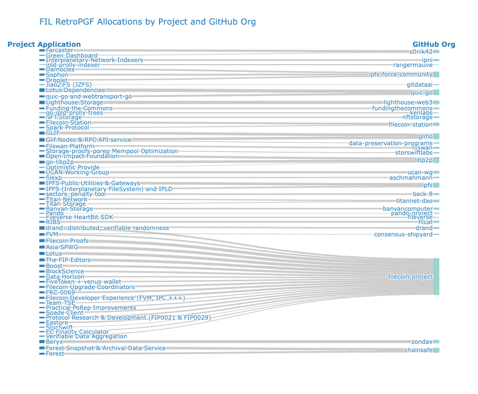

This was true not just for big projects but also for some of the smaller ones. For instance, the projects Titan Storage and Titan Network both pointed to the titannet-dao/titan-node repo.

Of course, not every repo is created equally. Even if we consider a rough input to the work, such as the mythical “developer month”, we can see that some GitHub org spaces have a lot more action than others but received less funding, proportionally, for that work.

The Sankey graph below takes the same data as the one above, but weights it by “developer months” gleaned from projects’ commit history instead of RetroPGF rewards. In this example, a “developer month” is a unique GitHub contributor who has made more than 3 commits to a particular repo in a given month (going back to 2021).

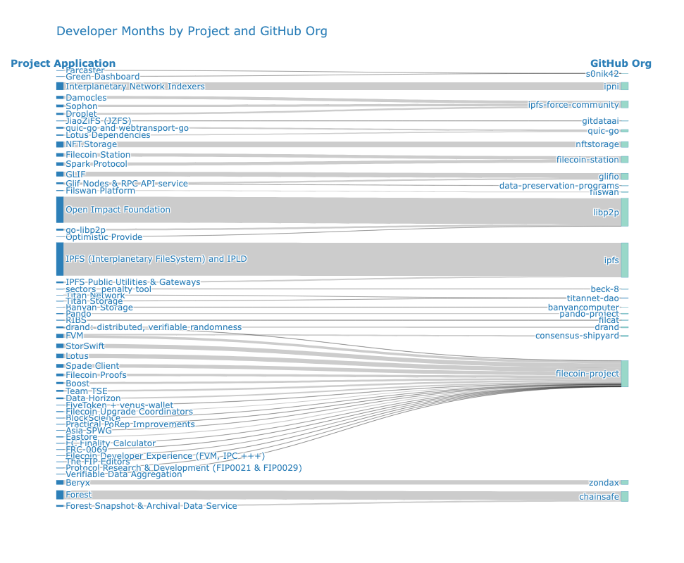

Whereas the first Sankey, which is weighted by FIL allocation, shows a fairly uniform distribution by project, the second Sankey, which is weighted by developer months, looks very different. There’s little correlation between FIL RetroPGF and developer months by project or GitHub org space.

If we were to view each GitHub org as a project and then calculate the amount of FIL per developer month, we would see that smaller projects have a much higher ROI.

For instance, a project that received 5000 FIL and has been running for 2 years with a 3 person team (72 developer months) would receive about 70 FIL per developer month. Compare this to a project receiving 4000 FIL over 36 developer months, ie, 140 FIL per developer month.

This is the opposite of what we normally see in the world. Impact tends to compound with scale, not decay.

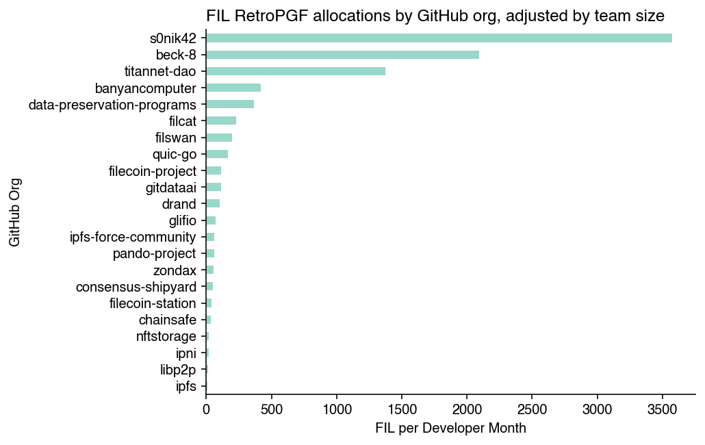

Sure, “developer months” is a very rudimentary metric. But the point is more that there were exponential differences in terms of input among projects and relatively small differences in terms of FIL rewards.

If there were exponential differences in terms of input, then presumably there should also be exponential differences in terms of impact. If RetroPGF-style funding is to be a meaningful source of revenue for builders, then this issue will need to be addressed.

Optimism’s RetroPGF has faced the same problem: small teams tend to receive more per contributor than large ones.

## How metrics can help with future rounds

All of this informs several recommendations for how future rounds of FIL RetroPGF can become more data-driven. Data can help overcome cognitive biases, lead to more objective measurement, and calibrate the round mechanics.

1. **Situate projects along impact vectors, not categories.** For instance, a category like “governance” might have a north star related to “progressive decentralization”. Projects should describe (and bring easy-to-verify data) concretely how they are contributing to this, not their own version of what they think governance is about. In the near term, this means it should be easier to make apples-to-apples comparisons within an impact domain. In the long term, as the ecosystem grows larger and more complex, this could turn into focused rounds with different eligibility requirements, badgeholder constituencies, and voting mechanisms.
2. **Try to create more standards around contributions and impact metric links.** Links have potential to introduce new information about projects that could be normalized and supplement the narrative. However, apart from GitHub links, there was very little consistency. Badgeholders would have had to click through each link and try to determine on their own what information was relevant to evaluating impact. In the near term, FIL RetroPGF should be more opinionated about the categories of links it’s interested in getting. In the long term, the most common types of links should be replaced with data widgets that projects can select to highlight their impact.

3. **Reduce overlapping impact claims.** Unless you are a core contributor to a project, it can be difficult to evaluate overlapping impact claims. For instance, it is difficult to distinguish the impact of a team claiming impact for a specific pull request from the impact of a team maintaining the repo the pull request was made to (and ostensibly claiming the impact of all forms of contribution to that repo). [Hypercerts](https://hypercerts.org/) are intended to help with this type of problem. However, even if you can properly account for it, it will remain difficult for the average badgeholder to parse closely related impact claims. In the near term, FIL RetroPGF should consider limiting projects from claiming impact within the same repo or other well-defined work space. In the long run, it would be great to see hypercerts (or at least the hypercert data schema) help projects define their contributions more precisely.

Overall, FIL RetroPGF was an exciting experiment. A large and diverse cohort of projects participated. The operations were smooth and relatively painless (as these things go). Badgeholders took their jobs seriously. There was healthy debate and discussion throughout. And, most importantly, there are 99 builder teams with more FIL in their wallets in recognition of their impact. We’re excited to support future iterations and to help the ecosystem leverage the data it needs to improve funding outcomes.
