Voting for Optimism’s fourth round of Retroactive Public Goods Funding (“Retro Funding”) opened on June 27 and will run until July 11, 2024. You can check out the voting interface [here](https://round4.optimism.io/welcome).

As discussed in our companion post, [Impact Metrics for Optimism Retro Funding 4](https://docs.opensource.observer/blog/impact-metrics-rf4), the round is a significant departure from the previous three rounds. This round, voters will be comparing just 16 metrics – and using their ballots to construct a weighting function that can be applied consistently to the roughly 200 projects in the round.

This post is a deeper dive on the work we did at Open Source Observer to help organize data about projects and prepare Optimism badgeholders for voting.

<!-- truncate -->

## Where the metrics come from

We built a first-of-its-kind data pipeline for the Superchain: not only the data but also all source code, query logic, and underlying infrastructure is publicly available for use. We aren’t aware of any other fully open data pipelines of this size or complexity built this way.

You can check out the docs for how to get or build on top of the data [here](https://docs.opensource.observer/docs/integrate/).

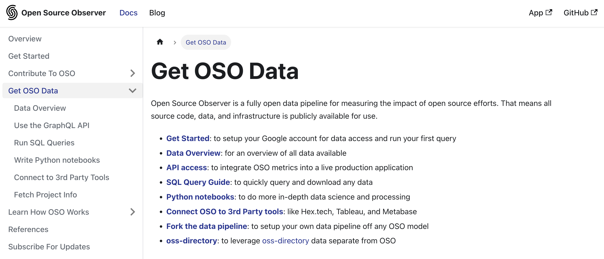

You can also see the full data model [here](https://models.opensource.observer/#!/model/model.opensource_observer.rf4_impact_metrics_by_project).

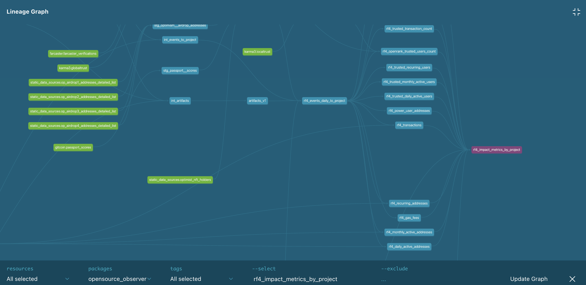

You can even view the complete pipeline and see the status of each job [here](https://dagster.opensource.observer/).

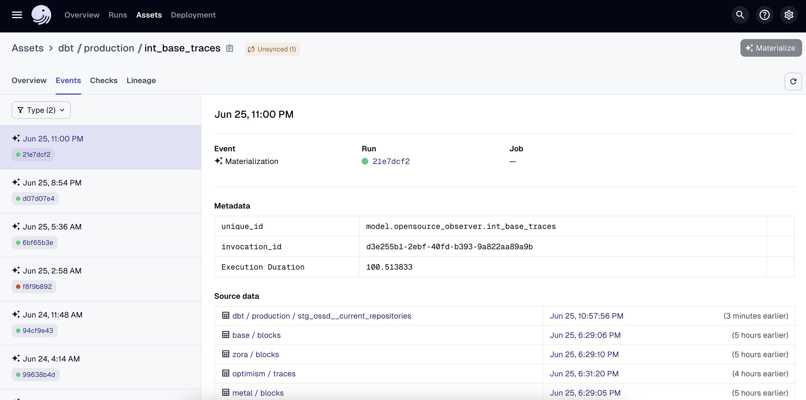

Although this infrastructure was critical to generating the metrics for RF4, it can now power a variety of other use cases. If you don't like our design choices, you can even fork the whole pipeline. We’re excited to see what the community builds on top!

### Unified events model for the Superchain

There previously didn’t exist a unified transaction + trace model for the Superchain. Dune, for example, [currently](https://docs.dune.com/data-catalog/overview#evm-chains) includes Base, Optimism mainnet, and Zora chains – but not Frax, Metal, or Mode.

With data generously provided by GoldSky, Open Source Observer built a unified Superchain event model which anyone [can access directly](https://docs.opensource.observer/docs/integrate/) and do whatever they want with. Although the model contains all Superchain transactions and traces, it does not have logs in it (yet).

A unified events model means you can write a query like this:

```sql
select *
from `opensource-observer.oso.int_events`
where
  event_source in (‘BASE’, ‘OPTIMISM’, ‘FRAX’, ‘METAL’, ‘MODE’, ZORA’)
  and event_type = ‘CONTRACT_INVOCATION_DAILY_COUNT’
```

And generate a graph that looks like this in your [preferred visualization tool](https://docs.opensource.observer/docs/integrate/3rd-party):

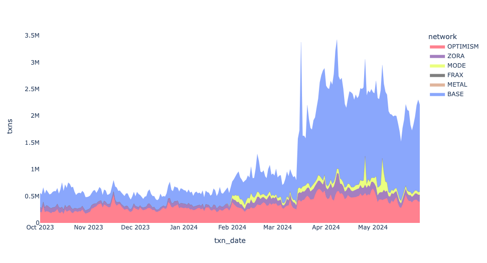

You can also do the same thing for GitHub and other types of events.

```sql
select *
from `opensource-observer.oso.int_events`
where
  event_source = ‘GITHUB’
  and event_type = ‘PULL_REQUEST_MERGED’
```

We quietly released our unified events model last month and already have a number of teams building on top of it. As new OP stack chains come online, this unified events model should prove even more helpful.

### Tagged project address registry

Another foundational building block is a registry we maintain called [OSS Directory](https://github.com/opensource-observer/oss-directory). It is a public repository of projects and their associated GitHub repos, NPM packages, deployers, contracts, and other open source artifacts, with a strict schema and validation logic to ensure consistency.

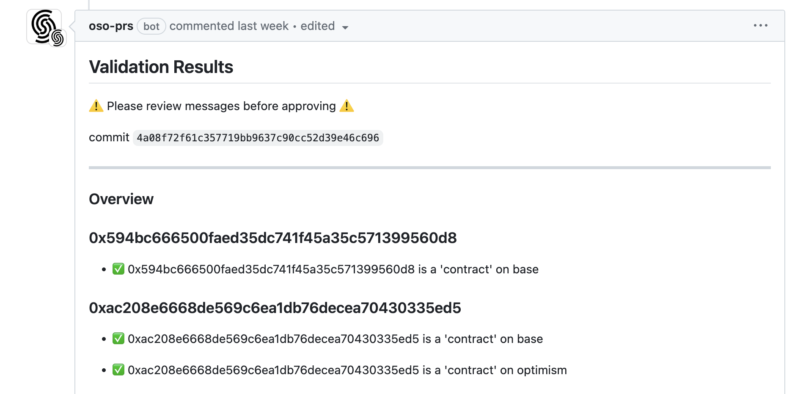

Every project that applied for Retro Funding (and met eligibility criteria) is included in [OSS Directory](https://github.com/opensource-observer/oss-directory).

As described in [our docs](https://docs.opensource.observer/docs/how-oso-works/oss-directory/artifact), OSS Directory has one strict rule: an artifact can only belong to one project at a time. This means that a blockchain address or a repo cannot be included in multiple projects.

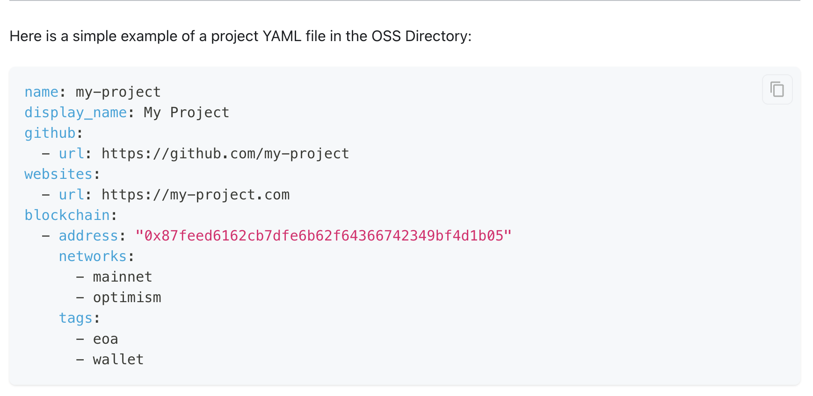

You can get the data by cloning the repo, through [our API](https://docs.opensource.observer/docs/integrate/api), and as an [NPM package](https://docs.opensource.observer/docs/integrate/oss-directory#npm-library). We also quietly released a [Python package](https://pypi.org/project/oss-directory/) last week! You can install it with `pip install oss-directory`.

### Contract discovery model

In the first version of OSS Directory, we enumerated every contract deployment as well as the root deployer, if it was owned by the same project. This quickly became unwieldy and impractical to maintain, as new contracts are being deployed all the time.

While we still maintain the legacy artifacts that were added in this way, we’ve moved to a more scalable method of contract discovery. If a project owns its deployer and gives it the `any_evm` tag, then we monitor every EVM chain for deployments from that address. If a project deploys a factory, then we also associate every contract deployed by that factory with the project that owns the factory.

There are several notable exceptions, for instance, contracts deployed using a `create2` factory are not credited to the deployer of the `create2` contract.

In general, a project owns everything downstream of its artifacts in OSS Directory. Thus, from the 2240 contracts that were verified through the RF4 sign-up process, we “discovered” 376,000 downstream contracts. These include everything from smart contract wallets created by Biconomy and Daimo, to NFTs minted on platforms like Zora and Sound, to perps on Kwenta and pairs on Aerodrome.

Here is a visualization of gas fees by contract address across the superchain:

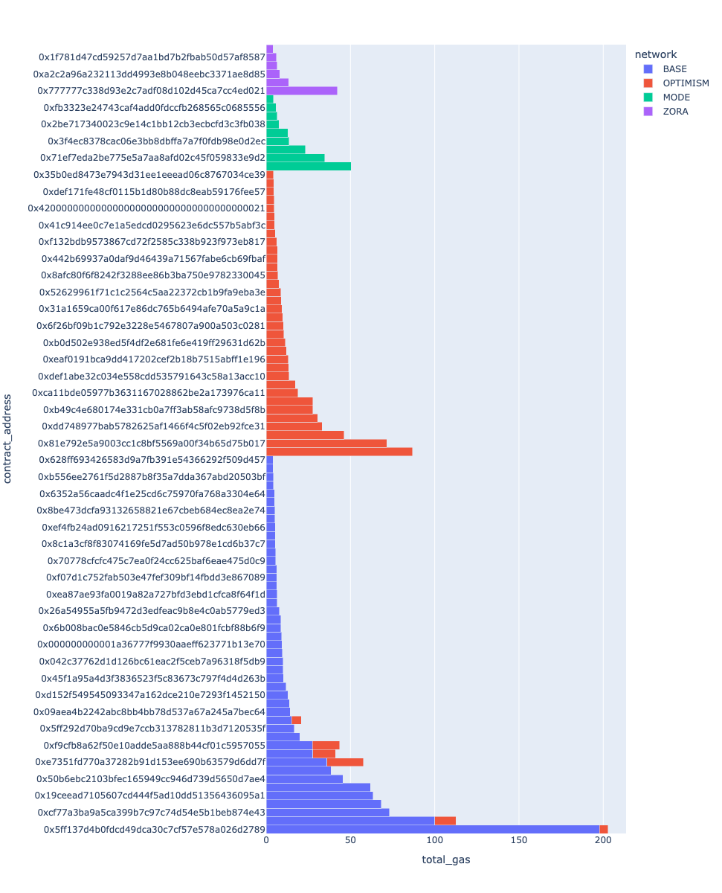

You can see all of the discovered contracts [here](https://github.com/opensource-observer/insights/tree/main/analysis/optimism/retrofunding4/data).

### Trusted user model

A "trusted user" represents an address linked to an account that meets a certain threshold of reputation.

This metric aggregates reputation data from multiple platforms ([Farcaster](https://docs.farcaster.xyz/learn/architecture/hubs), [Passport](https://www.passport.xyz/), [EigenTrust by Karma3Labs](https://docs.karma3labs.com/eigentrust)), the [Optimist NFT collection](https://app.optimism.io/optimist-nft), and the OP Labs data team.

You can view the model [here](https://models.opensource.observer/#!/model/model.opensource_observer.rf4_trusted_users_onboarded#details).

In order to be consider a trusted user, an address had to meet at least two of the following requirements as of 2024-05-21:

- Have a Farcaster ID of 20939
- Have a Passport score of 20 points or higher
- Have a Karma3Labs EigenTrust GlobalRank in the top 42,000 of Farcaster users
- Hold an Optimist NFT in their wallet
- Qualify for at least two (out of four) Optimism airdrops.

A total of 83K addresses met these requirements. A complete list is available as a CSV file [here](https://github.com/opensource-observer/insights/blob/main/analysis/optimism/retrofunding4/data/op_rf4_trusted_addresses.csv).

We're excited to see how this type of model evolves and is extended for future use cases.

## Developing the impact metrics

The following design principles guide the development and evolution of [impact metrics](https://docs.opensource.observer/docs/how-oso-works/impact-metrics/#principles):

- Verifiability: Metrics should be based on public data that can be independently verified. They should not rely on proprietary data sources or private APIs.
- Reproducibility: Metrics should be easy to reproduce, simulate, and audit to ensure they are achieving the intended results. They should not have a "black box" element that makes them difficult to understand or replicate.
- Consistency: Metrics should be consistent across projects and artifacts. They should be calculated using the same methodology and data sources to ensure that they are comparable.
- Completeness: Metrics should be comprehensive and cover all projects and artifacts in the OSO database that fulfill basic requirements. They should not be highly sector-specific (eg, only relevant to Defi or NFT projects)
- Simplicity: Metrics should have business logic that is easy to understand. They should not require a deep understanding of the underlying data or complex statistical methods to interpret.

Given limited time and bandwidth, it was impossible to implement and test every good idea for an impact metric that we received. There was also an explicit goal set at the start of the round of choosing the best 15-20 metrics.

### Eligibility requirements

The round had very explicit eligibility criteria as well as impact attribution rules. They were determined at the start of the process by the Foundation, turned into automatic checks that we ran when projects applied, and vetted closely by the team of badgeholder reviewers.

To be eligible for RF4, a project had to:

- Deploy its own contracts on the Superchain (not via another project’s factory)
- Have its first transaction on the Superchain before 2024-04-01
- Have at least 10 days of onchain activity
- Have at least 420 unique addresses _initiating_ transactions with contracts they own

All of these checks were applied to a tight time interval of 2024-01-01 to 2024-05-01. There were over 200 projects that applied and did not meet these requirements.

Some of the most common reasons for otherwise strong projects failing to meet eligibility criteria included:

- They were initiating transactions on behalf of users (eg, the user was the `to` address in the transaction)
- They were using factory contracts deployed by other projects (eg, minting platforms like Zora or Sound)
- They work by enabling their users to deploy their own contracts without interacting with a factory (eg, JokeRace)
- They were built on primitives that made it impossible to trace user interactions with the data available for the round or without employing some form of project- or use case-specific analysis on top of that data (eg, interactions via Farcaster frames or certain types of account abstraction projects)

### Special cases, including 4337-related transactions

There were two exceptions made to the business logic above.

Projects interacting with the 4337 EntryPoint contracts were given credit for transactions and smart contract wallet addresses that were directly linked to contracts they owned, although the gas associated with such interactions was still attributed to the team that deployed the 4337s contracts. This (positively) affected metrics for a handful of account abstraction projects, including Beam, Biconomy, and Daimo. Unfortunately, projects that were one step further along the value chain, ie, that interacted with popular account abstraction operators like Biconomy and Pimlico, were not captured by the metrics.

Account abstraction is an extremely important growth vector for the Superchain. However, we can only reward what we can measure and verify. We need better data standards and public datasets for 4337 related contributions. These learnings should be taken to heart and hopefully improved upon in future rounds.

The other exception was for transactions made to EOA bridges. These were treated like interactions with a standard contract.

### Evolution of metrics

There were many excellent suggestions for impact metrics leading up to the round.

In the end, we arrived at a hopefully well-balanced set of 16 metrics. You can get the full details on the metrics from our companion post [here](https://docs.opensource.observer/blog/impact-metrics-rf4). We expect even more recommendations to emerge now that voting is open.

The governance forum also includes a [lengthy post](https://gov.optimism.io/t/retro-funding-4-impact-metrics-a-collective-experiment/8226) detailing the full process of arriving at a distilled set of impact metrics together with badgeholders.

## Visualizing the metrics

I’ve included a few data visualizations performed on top of the metrics below.

This treemap shows the distribution of gas fees by project across the Superchain. The size of each rectangle is proportional to the gas fees generated from the contract, and the color represents the chain that activity is on. Projects that have deployed contracts on multiple chains are represented by multiple rectangles.

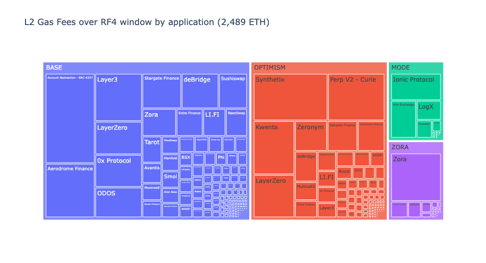

This scatterplot shows the relationship between the total number of transactions to a project's contracts (x axis) and the total number of transactions that come from "trusted users" (y axis). The size of each point is proportional to the share of transactions that come from trusted users.

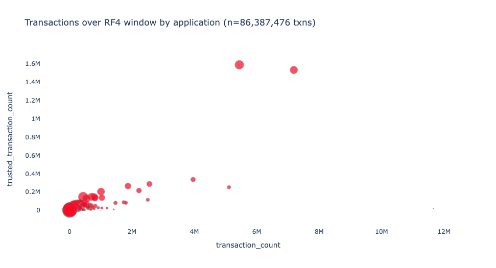

The scatterplot below is the same as the one above, but with both axes on a log scale. This visualization is helpful for showing orders of magnitude differences in the number of transactions.

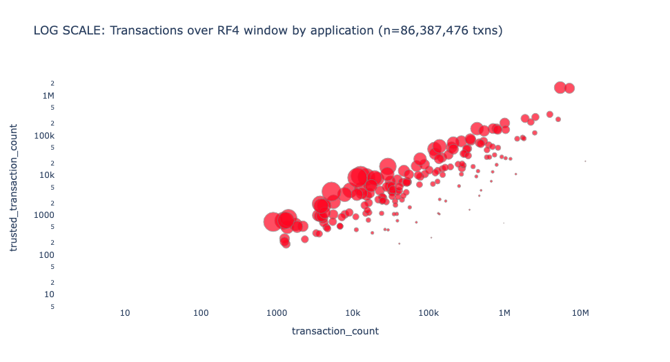

Finally, we have a visualization of a more experimental metric: OpenRank Trusted Users. This metric captures the count of addresses in the badgeholder "web of trust" who have interacted with the project over the RF4 scope period. The chart below only shows the top 40 projects by this metric.

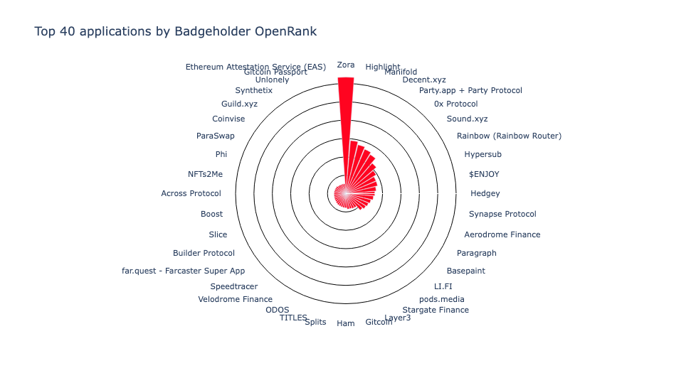

For more information about any of the metrics, you can see the [full list](https://docs.opensource.observer/blog/impact-metrics-rf4#current-metrics) or view the underlying model and source code [here](https://models.opensource.observer/#!/model/model.opensource_observer.rf4_impact_metrics_by_project) or in [our GitHub](https://github.com/opensource-observer/oso/tree/main/warehouse/dbt/models/marts/superchain/metrics).

## Links and resources to learn more

Finally, we've included an appendix of relevant resources maintained by OSO:

- Docs on how to directly query or integrate with OSO data: [https://docs.opensource.observer/docs/integrate/](https://docs.opensource.observer/docs/integrate/)
- Catalog (and compiled query logic) of all OSO models: [https://models.opensource.observer/#!/model/model.opensource_observer.rf4_impact_metrics_by_project](https://models.opensource.observer/#!/model/model.opensource_observer.rf4_impact_metrics_by_project)
- Interactive visual of the complete data pipeline leading up to impact metrics: [https://models.opensource.observer/#!/model/model.opensource_observer.rf4_impact_metrics_by_project?g_v=1&g_i=%2Brf4_impact_metrics_by_project%2B](https://models.opensource.observer/#!/model/model.opensource_observer.rf4_impact_metrics_by_project?g_v=1&g_i=%2Brf4_impact_metrics_by_project%2B)
- Tagged project artifacts: [https://github.com/opensource-observer/oss-directory](https://github.com/opensource-observer/oss-directory)
- Collection of projects included in RF4: [https://github.com/opensource-observer/oss-directory/blob/main/data/collections/op-retrofunding-4.yaml](https://github.com/opensource-observer/oss-directory/blob/main/data/collections/op-retrofunding-4.yaml)
- Dumps of trusted addresses and contract attribution: [https://github.com/opensource-observer/insights/tree/main/analysis/optimism/retrofunding4/data](https://github.com/opensource-observer/insights/tree/main/analysis/optimism/retrofunding4/data)
- CSV version of impact metrics: [https://github.com/opensource-observer/insights/blob/main/analysis/optimism/retrofunding4/data/op_rf4_impact_metrics_by_project.csv](https://github.com/opensource-observer/insights/blob/main/analysis/optimism/retrofunding4/data/op_rf4_impact_metrics_by_project.csv)

If you have further questions, please reach out to us on [Discord](https://www.opensource.observer/discord). We're excited to see what the community builds on top of this data and how it can be used to inform future rounds of Retro Funding!
