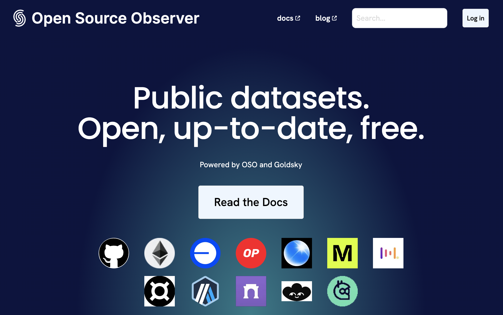

At Open Source Observer, we have been committed to building everything
in the open from the
[very beginning](../2023-11-07-open-source-open-data-open-infra.mdx).
Today, we take that openness to the next level by launching the
OSO Data Exchange on Google BigQuery.
Here, we will publish every data set we have as live,
up-to-date, and free to use datasets.
In addition to sharing every model in the
[OSO production data pipeline](https://docs.opensource.observer/docs/integrate/overview/#oso-production-data-pipeline),
we are sharing source data for blocks/transactions/traces across
[7 chains in the OP Superchain](https://docs.opensource.observer/docs/integrate/overview/#superchain-data)
(including Optimism, Base, Frax, Metal, Mode, PGN, Zora),
[Gitcoin Passport scores](https://docs.opensource.observer/docs/integrate/overview/#gitcoin-passport-data),
and [OpenRank](https://docs.opensource.observer/docs/integrate/overview/#openrank-data).
This builds on the existing BigQuery public data ecosystem that includes
[GitHub](https://docs.opensource.observer/docs/integrate/overview/#github-data),
[Ethereum](https://docs.opensource.observer/docs/integrate/overview/#ethereum-data),
[Farcaster](https://docs.opensource.observer/docs/integrate/overview/#farcaster-data),
and [Lens](https://docs.opensource.observer/docs/integrate/overview/#lens-data) data.
To learn more, check out the data portal here:

<p style={{"text-align": "center"}}>
[opensource.observer/data](https://www.opensource.observer/data)
</p>



<!-- truncate -->

A huge thank you to our data partners from
[Goldsky](https://goldsky.com/),
[Gitcoin](https://www.gitcoin.co/), and
[Karma3 Labs](https://karma3labs.com/) for helping make this happen!

## Why are we doing this?

We are living in a world where open ecosystems are out-innovating closed ecosystems.
As firm believers in the power of open source, we are growing a
[network of impact data scientists](https://docs.opensource.observer/blog/impact-data-scientists)
to help demonstrate and visualize the immense impact that
open source software is having on the world, starting with crypto ecosystems.
We hope that better understanding of the impact of open source will lead to
better appreciation, higher engagement, and ultimately deeper investments
into open source technologies.
For example, OSO data is used in the latest
[Optimism retrofunding round](https://docs.opensource.observer/blog/impact-metrics-rf4-deep-dive)
to distribute >$10M to builders.

## What can I do with this data?

We have written [several guides](https://docs.opensource.observer/docs/integrate/)
on how to leverage this data, from immediately
[making queries in BigQuery](https://docs.opensource.observer/docs/get-started/),
to exploring the data in a
[Python notebook](https://docs.opensource.observer/docs/integrate/python-notebooks),
to integrating with a
[3rd party data tool](https://docs.opensource.observer/docs/integrate/3rd-party),
like [Hex](https://docs.opensource.observer/docs/integrate/3rd-party#hex-example),
or [Tableau](https://cloud.google.com/bigquery/docs/analyze-data-tableau).
If you end up using this data, we only ask that you share what you’ve learned and tag us
[@OSObserver](https://x.com/osobserver).

You should start by subscribing to a dataset from our
[Data Overview](https://docs.opensource.observer/docs/integrate/overview/).
Once you’ve subscribed, you can run queries in your favorite data tool.

For example to get a summary of code activity for
[Uniswap](https://uniswap.org/),

```sql
select *
from `YOUR_PROJECT_NAME.oso_production.code_metrics_by_project_v1`
where project_name = 'uniswap'
```

Or lookup deployed contracts from a particular address on
[Base](https://www.base.org/):

```sql
select
  traces.block_timestamp,
  traces.transaction_hash,
  txs.from_address as originating_address,
  txs.to_address as originating_contract,
  traces.from_address as factory_address,
  traces.to_address as contract_address
from `YOUR_PROJECT_NAME.superchain.base_traces` as traces
inner join transactions as txs
  on txs.hash = traces.transaction_hash
where
  LOWER(traces.from_address) != "0x3fab184622dc19b6109349b94811493bf2a45362"
  and LOWER(trace_type) in ("create", "create2")
```

Or lookup vitalik.eth’s
[Gitcoin passport](https://passport.gitcoin.co/)
score:

```sql
select
  passport_address,
  last_score_timestamp,
  evidence_rawScore,
  evidence_threshold,
from YOUR_PROJECT_NAME.gitcoin.passport_scores
where passport_address = '0xd8da6bf26964af9d7eed9e03e53415d37aa96045'
```

When you’ve developed a novel impact metrics or data model,
we encourage you to
[contribute back to the OSO data pipeline](https://docs.opensource.observer/docs/contribute/impact-models),
which is continuously deployed from our
[open source repository](https://github.com/opensource-observer/oso/).

## How can I help?

If you love supporting open source like we do, reach out to us over
[email](mailto:info@karibalabs.co) or
[Discord](https://www.opensource.observer/discord). We are hiring founding engineers,
[onboarding new data sources](https://docs.opensource.observer/docs/contribute/),
and working with our partners to evolve our understanding of impact.
