Optimism’s Retro Funding Round 5 (RF5) just wrapped up, with 79 projects (out of ~130 applicants) awarded a total of 8M OP for their contributions to Ethereum and the OP Stack. You can find all the official details about the round [here](https://gov.optimism.io/t/retro-funding-5-op-stack-round-details/8612).

In some ways, this round felt like a return to earlier Retro Funding days. There were fewer projects than Rounds 3 and 4. Venerable teams like Protocol Guild, go-ethereum, and Solidity were back in the mix. Voters voted on projects instead of metrics.

However, RF5 also introduced several major twists: voting within categories, guest voters, and an expertise dimension. We’ll explain all these things in a minute.

Like [our other posts](https://docs.opensource.observer/blog/rf4-ballot-box) in the “opening up the ballot box” canon, this post will analyze the shape of the rewards distribution curve and the preferences of individual voters using anonymized data. We’ll also deep dive into the results by category and compare expert vs non-expert voting patterns.

Finally, we'll tackle the key question this round sought to answer: _do experts vote differently than non-experts?_ In our view, the answer is yes. We have a lot of data on this topic, so you're welcome to draw your own conclusions.

<!-- truncate -->

## How the round worked

RF5 was a highly technical round. Projects were organized into three categories:

- **Ethereum Core Contributions**. Smart contract languages, Ethereum consensus & execution clients, EVM, Ethereum testnets, Cryptography research.
- **OP Stack R&D**. Optimism Protocol upgrades, OP Stack Client Implementations, modules & mods, audits and Fault Proof VM implementations.
- **OP Stack Tooling**. Integration and load testing infrastructure, scripts for running an Optimism node, RaaS providers, OP Stack tutorials & documentation.

Unlike previous rounds, these categories were strictly enforced. Applications were rejected if they weren’t a good fit for any of the categories.

Each voter was randomly assigned a category of 20-30 projects to vote on. Voters also voted on an overall budget for the round (up to 8M OP) and how the total budget should be divided across the three categories (eg, 40% / 30% / 30%).

62 out of 111 voters opted for the max allocation of 8M OP, so this ended up being the round size. There was more divergence in the allocation per category, which we’ll come back to.

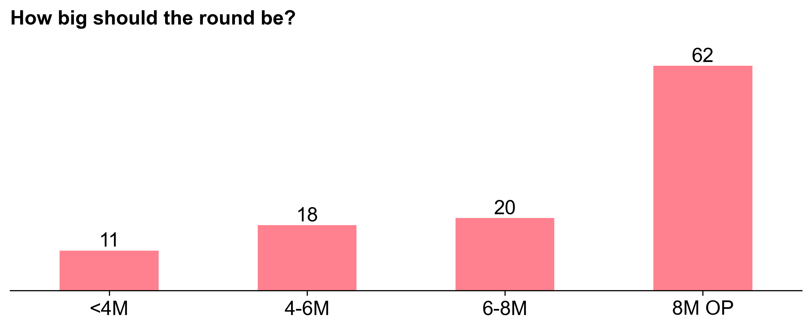

Given the round's technical focus, there was a hypothesis that experts would allocate rewards differently than non-experts. To test this, the Foundation, in collaboration with OpenRank (and us), assigned each badgeholder an [“expertise"](https://gov.optimism.io/t/retro-funding-5-expert-voting-experiment/8613) measure based on their GitHub history. In addition, a group of external experts were invited to join the “Citizen” badgeholders as [guest voters](https://gov.optimism.io/t/retro-funding-5-announcing-guest-voter-participation/8393).

In total, the round had 111 voters, of which 84 were normal Citizens and 27 were Guests. All 27 guest voters were experts, whereas 29 out of the 84 Citizens were classified as experts (and 55 were non-experts).

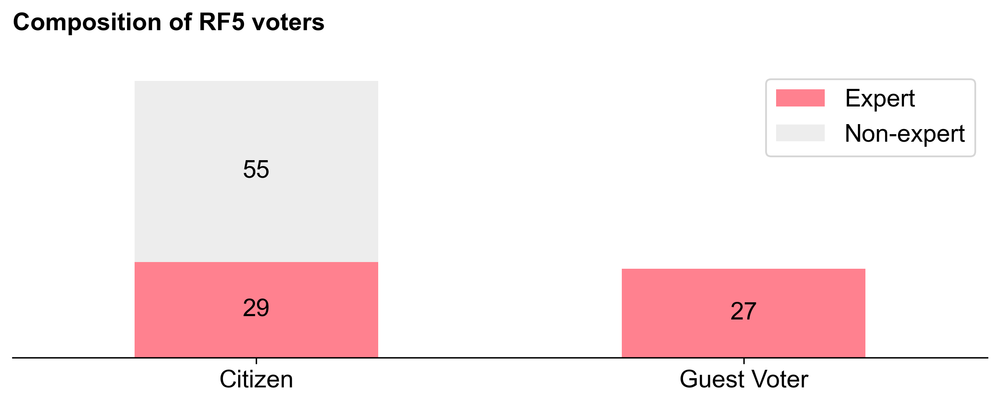

Regardless of designation, all voters had the same voting experience. After setting their overall budget and category allocations, voters rated the impact of every project in their category. Voters were expected to skip any projects they had a conflict of interest with; there were 19 conflicts of interest logged out of 2926 total project votes cast. Then, voters were given several options for applying a distribution function across their project ratings (e.g., step, linear, exponential, etc.). Finally, they had the option to refine their allocations project-by-project.

The reward function was similar to the one used for RF3 and RF4, which relied on median scores and a normalization algorithm.

Once again, you can find all the official details about the round [here](https://gov.optimism.io/t/retro-funding-5-op-stack-round-details/8612).

## Overall observations

We’ve written before about [the significance](https://docs.opensource.observer/blog/levels-of-the-game) of the reward distribution curve. It's an important signal for builders because it communicates the reward for being a top project vs a middle project. It should motivate builders to aim for creating huge impact, and it should give them a sense of how much they can expect to receive if they do.

### The RF5 distribution curve is pretty flat

Unfortunately, in our view, the RF5 curve doesn't provide a very clear signal to builders. Instead, the Retro Funding 5 distribution is what we refer to as "peanut butter spread": flat and chunky.

In fact, this was the flattest distribution of all five RF rounds. The top project, go-ethereum, received 235K OP (2.9% of the total). The median project received 93K. Even the lowest ranked project in Round 5 received 37K - more than what 70% of the projects in Round 4 received. It was a good round to be an “average” project in.

In [Round 4](https://docs.opensource.observer/blog/rf4-ballot-box), by contrast, there was a steep power law distribution. This was likely the result of the [metrics-based voting](https://docs.opensource.observer/blog/impact-metrics-rf4), as top projects often had orders of magnitude more impact according to the metrics. The top projects were capped at 500K OP (2% of the total). The median project received 13K OP.

[Round 3](https://docs.opensource.observer/blog/what-builders-can-learn-from-retropgf3) was more of a peanut butter spread, but not as flat as Round 5. The top project (Protocol Guild) received 2.2% of the total.

Round 2 had a particularly unique distribution curve: fairly linear up until the very end, then a big spike. The top project (Protocol Guild) received 1.9% of the total.

The flatter distribution resulted in a more equitable spread, allowing even lower-ranked projects to receive meaningful allocations.

### Smaller projects overperformed

In [our RF3 analysis](https://docs.opensource.observer/blog/what-builders-can-learn-from-retropgf3#projects-vs-individuals), we raised the concern that voting on projects can give smaller projects a comparative advantage:

> In addition to the incentive for everyone to throw their name in the hat next RetroPGF, there may also be a perverse incentive for individual contributors or factions from within larger projects or DAOs to apply.

Voters may be more likely to vote for smaller projects because they are easier to understand. There's also a tendency to give something to every project in the category (more on this later), or to assume that smaller projects are more deserving of funding.

This appears to have played out in RF5. Many of the larger projects from previous rounds saw a reduction in their RF5 funding. Examples include:

- Protocol Guild: 223K OP in RF5 (vs 663K OP in RF3)
- go-ethereum: 234K OP in RF5 (vs 496K OP in RF3)
- Solidity: 204K OP in RF5 (vs 422K OP in RF3)

Meanwhile, many of the smaller team efforts from RF3 saw an increase in their funding in RF5. Examples include:

- Hildr: 94K OP in RF5 (vs 62K OP in RF3)
- Understanding Optimism Codebase: 71K OP in RF5 (vs 29K OP in RF3)
- OPcity stack: 63K OP in RF5 (vs 25K OP in RF3)

Larger projects that broke up their contributions into smaller, discrete applications also saw an increase in their funding. For example:

- Nethermind: 438K OP for two applications in RF5 (vs 248K in RF3)
- libp2p: 384K OP for four applications in RF5 (vs 298K in RF3)
- Upnode: 285K OP for three applications in RF5 (vs 62K in RF3)

Without commenting on the question of whether smaller or more modular teams are more deserving of funding, this is a predictable outcome of a flatter distribution curve. The reward function is a game, and players will optimize for it.

### We got flat distributions because that's what voters voted for

While there may be aspects of the application process and voting UI that influence the shape of the distribution, the voters themselves are the primary drivers of the distribution curve. The RF5 distribution was flatter than previous rounds because voters voted for it to be that way.

Out of the 111 voters, 80% allocated funding to every project in their assigned category. Half of voters allocated at least 15K OP to _every project_ in their category. Again, by contrast, the median project in RF4 received 13K OP.

Only 26% of voters gave more than 12.5% to any one project in their category.

We can quantify vote variance by calculating the [coefficient of variation](https://en.wikipedia.org/wiki/Coefficient_of_variation) (CV) in the votes cast by each voter. A low CV indicates a voter believed every project deserved a similar allocation, while a high CV suggests more polarized voting behavior (favoring certain projects heavily). Below, we illustrate the difference between flatter and steeper distributions with two example voters.

This tendency toward flatter distributions was particularly pronounced among non-expert voters.

### Experts were less likely to vote on flat distributions

Now, let’s look at the CV across all 110 voters, with experts highlighted in red. (Note: I've ommitted the chad 111th voter who had the highest CV in order to make the chart look nicer.)

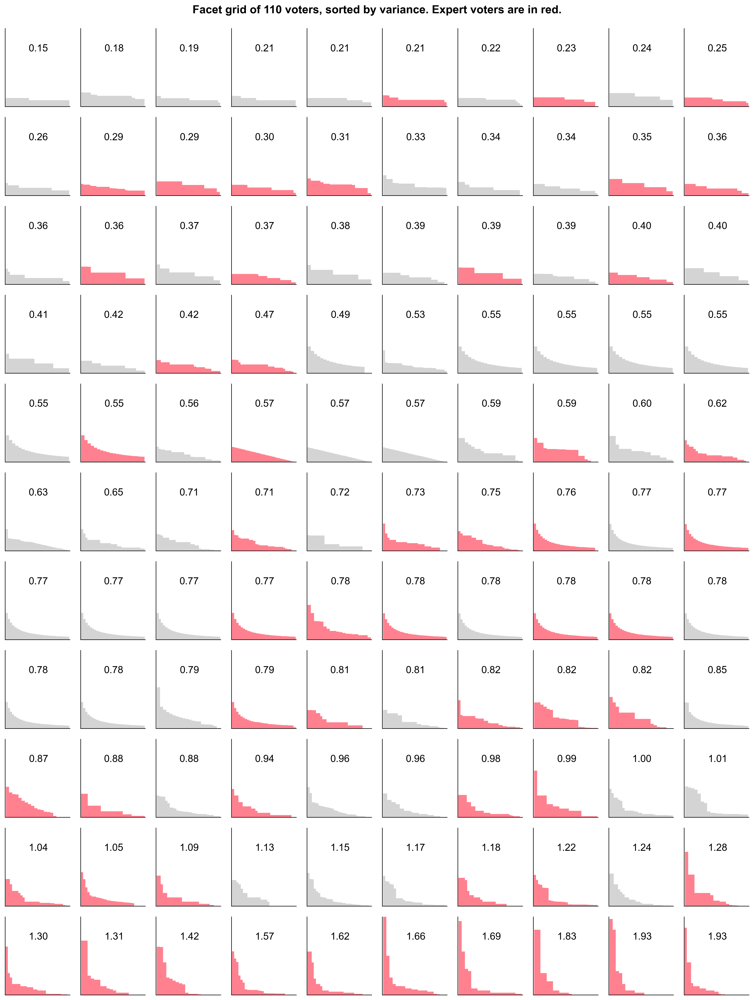

Many voters opted for step-shaped distributions. These are the flattest curves in the top rows, with a CV < 0.5. 21 out of 36 of these low variance voters were non-experts.

The power law distributions are mostly in the bottom rows. These voters had higher variance (CV > 1) in their allocations. The majority of these distributions (17/22) came from experts.

We also ran a simulation of the results if only experts or non-experts had voted. Non-experts tended to yield flatter distributions, while experts created a slightly steeper distribution curve.

Although the differences in the overall curve shapes are fairly subtle, the delta between experts and non-experts at the individual project level is significant. For instance, go-ethereum would have received 146K more OP if only experts voted. These "divisive" projects with a large delta are highlighted in the exhibit below.

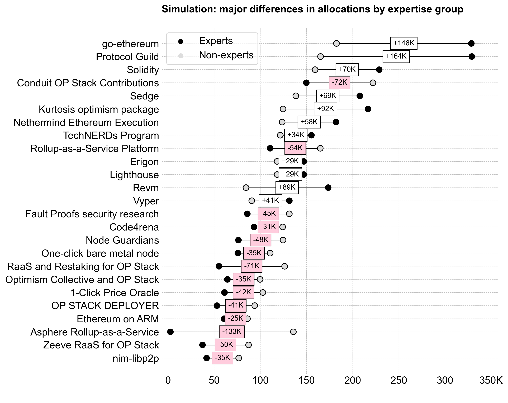

Experts’ high-assertion votes — where they allocated a significant percentage of the pool to a project they knew well — were a key factor in shaping the results. The variance between experts and non-experts is visualized below, showing the most divisive projects and the difference in standard deviation between groups.

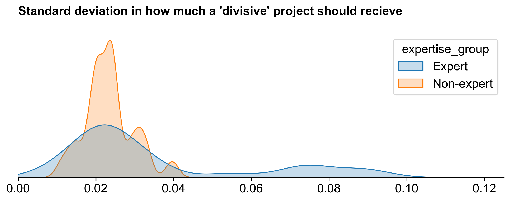

Overall, experts also had a much higher standard deviation in their votes for top projects than non-experts. This is probably a good thing: it means that the most knowledge people are also the ones most likely to hold strong opinions about projects. We can see this in the exhibit below, which compares the standard deviation of votes for each project over its median by group. (Only a few projects are labeled for clarity.)

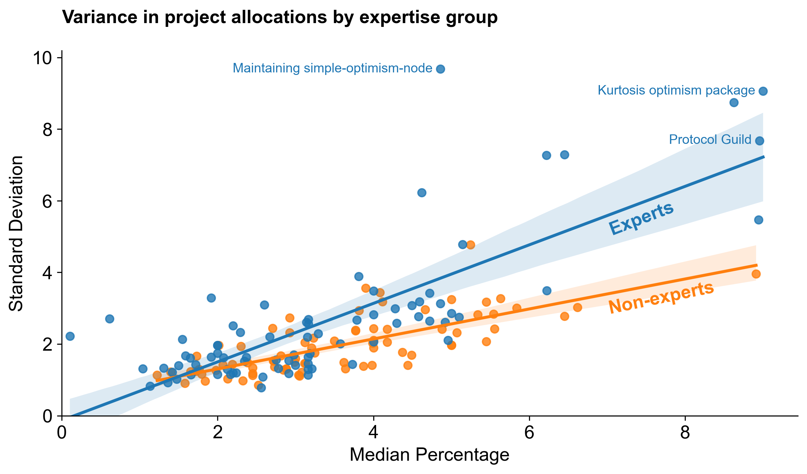

### Key takeaways

- Experts reached consensus on the top projects but varied in how much they thought these projects deserved.
- Non-experts had less consensus on the top projects and demonstrated less overall variance in their voting.

## Category-level results

The following section breaks down voting patterns and results by category.

### Ethereum Core Contributions

Voters assigned to Ethereum Core Contributions generally allocated less budget to the category than those assigned to the other categories.

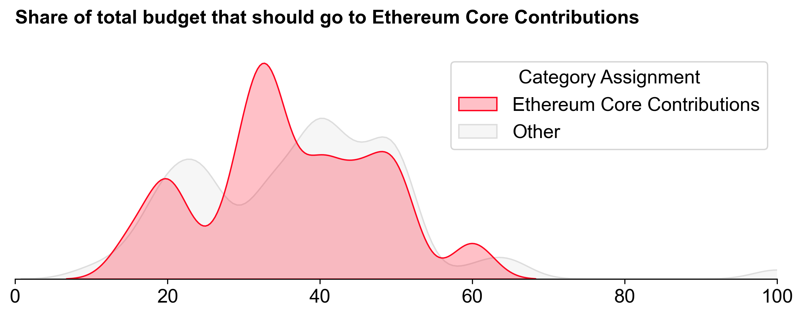

Despite this, Ethereum Core Contributions still received the largest share of the budget: 3.1M OP (~39%). It also exhibited the steepest distribution curve.

Consensus was strongest for the top half of projects. Most voters allocated something to projects from Lodestar upwards. However, the top projects (go-ethereum, Protocol Guild, and Revm) exhibited significant variance in allocations, with expert voters pushing them to the top.

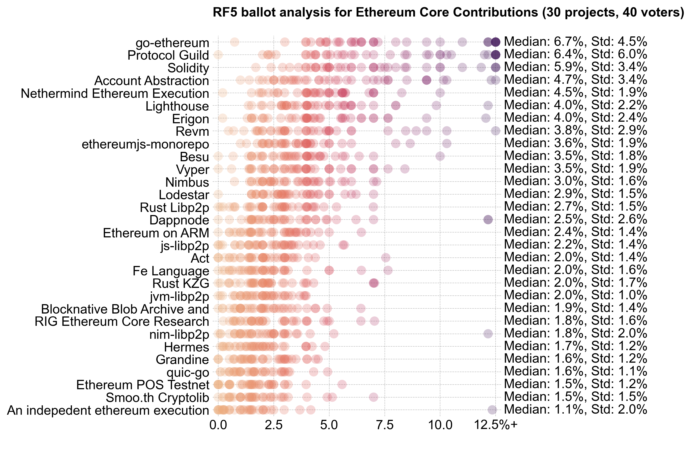

The key difference between experts and non-experts was at the top of the distribution, where experts favored go-ethereum and Protocol Guild more heavily.

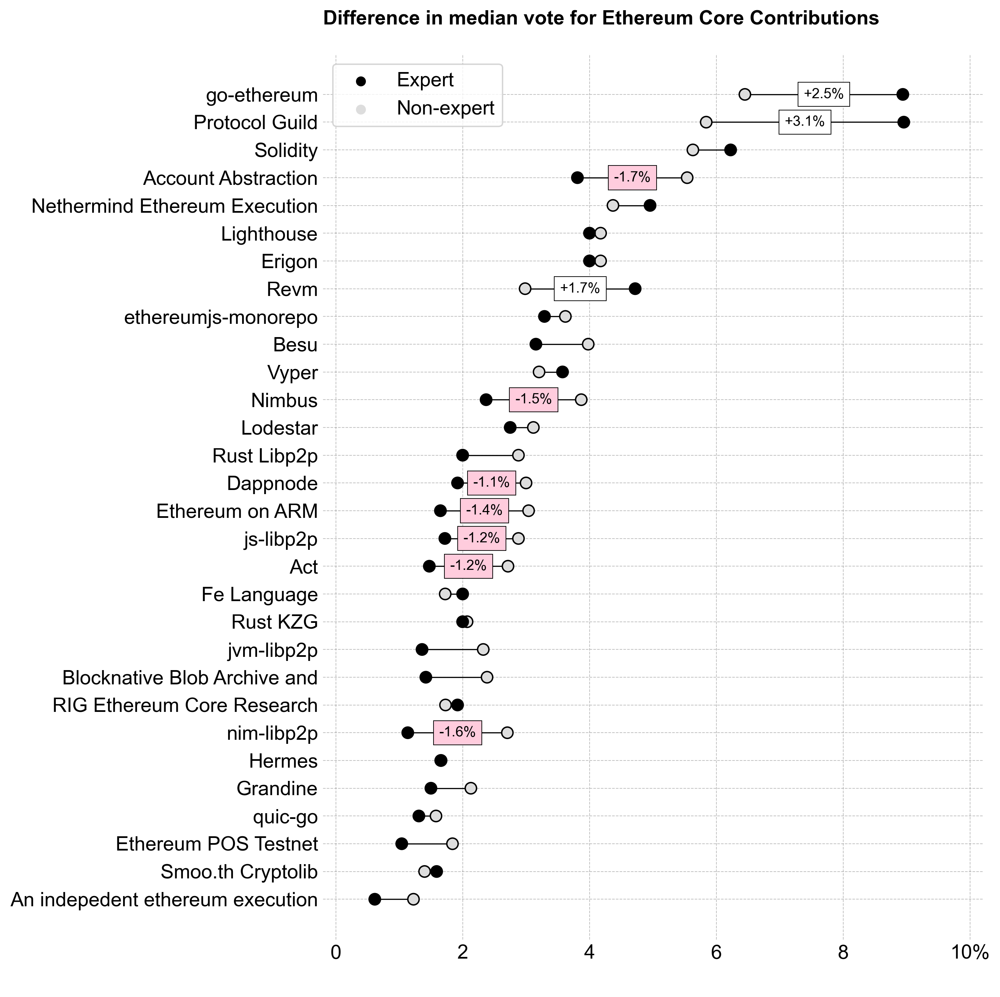

### OP Stack R&D

OP Stack R&D ranked second overall in terms of funding, with 2.8M OP (~35%). There was much more consensus on the percentage of the budget to allocate to this category, and little variance between people assigned to this category and assigned to the others.

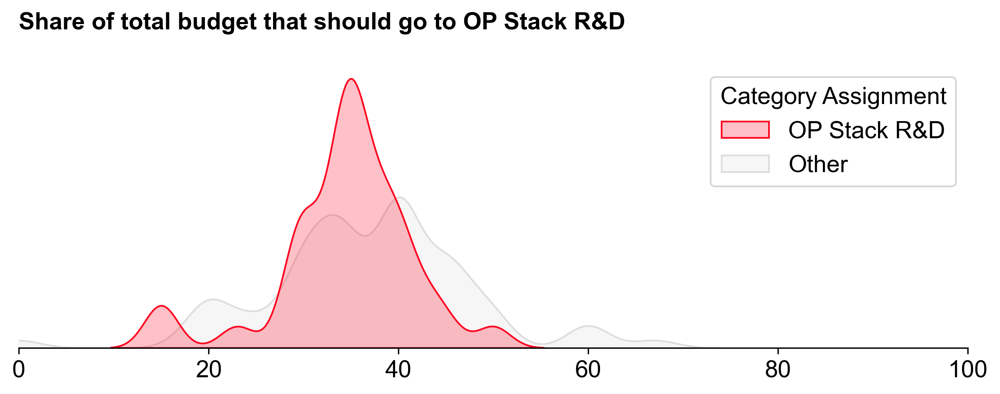

Alignment on the category's importance did not translate into clear consensus on the top projects. R&D is the realm of breakthroughs, which traditionally come with high uncertainty -- and potentially high impact.

Going into the round, I expected this category to have the strongest power law distribution. Instead, it had the flattest distribution. To me, this suggests that voters had a hard time differentiating between projects in this category.

Consensus projects were limited to the top few (OP Reth to EAS). There were very few projects with allocations above 10%.

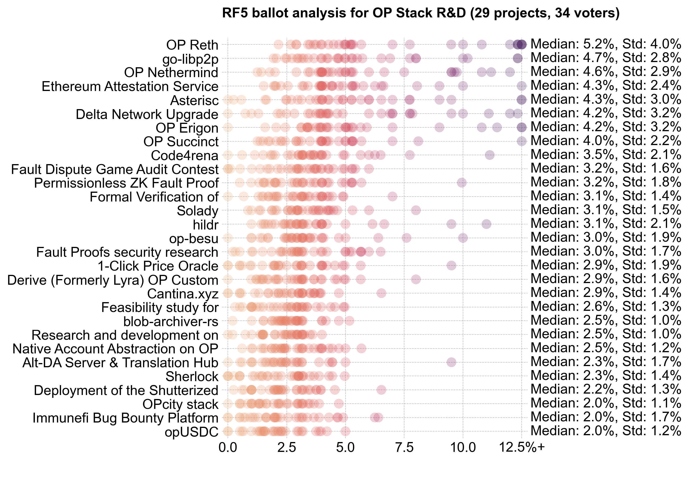

Interestingly, experts and non-experts had the smallest difference in their voting patterns for OP Stack R&D. Even experts may have struggled to differentiate projects in this category.

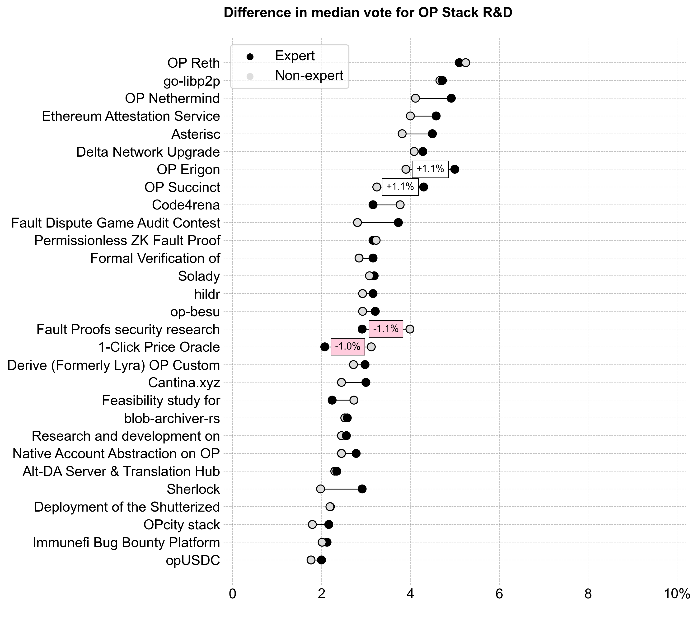

### OP Stack Tooling

Voters assigned to OP Stack Tooling were the most conservative in recommending a budget for this category. It received the smallest share of the budget: 2.1M OP (~26%).

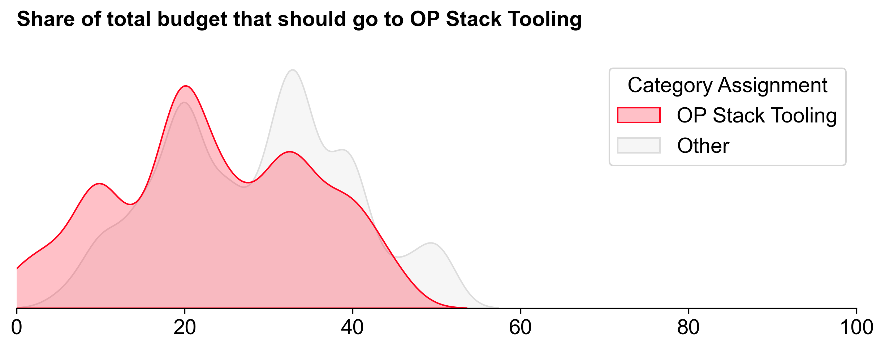

This category had the fewest projects and received the least funding, but its median allocation (94K OP) was higher than in the other two categories.

There was little consensus apart from the top projects (Conduit, Kurtosis, and Sedge). This category had the most divisive results, with a mixture of high and low allocations. Some projects received no votes from certain voters, while others saw over 12.5% allocations.

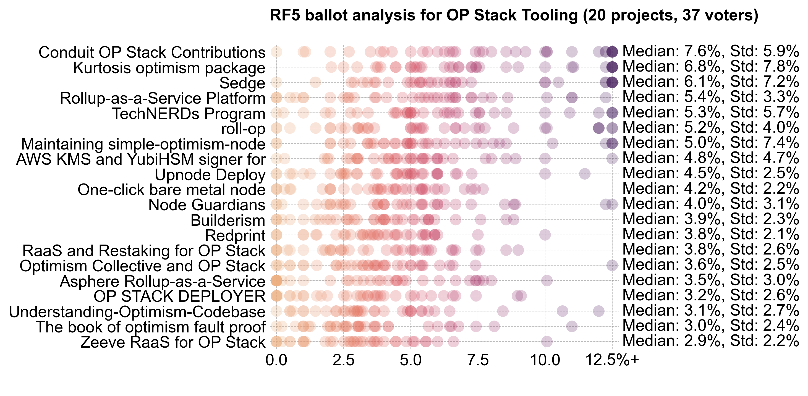

Experts rated projects lower overall, and the RaaS providers, in particular, sparked division between experts and non-experts.

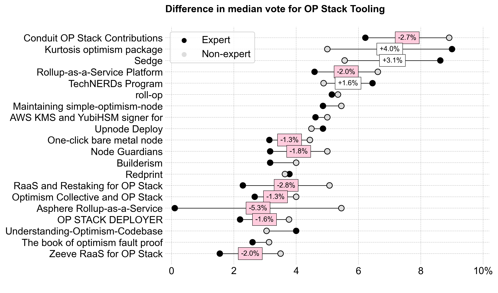

## Further explorations

### Voter confidence

In general, voters were somewhat to mostly confident that the allocations would be fair at the time they cast their ballot. We explored correlations between confidence and coefficient of variance, but didn't see any meaningful trends. We also looked at the relationship between confidence and expertise, but again, didn't see any clear patterns.

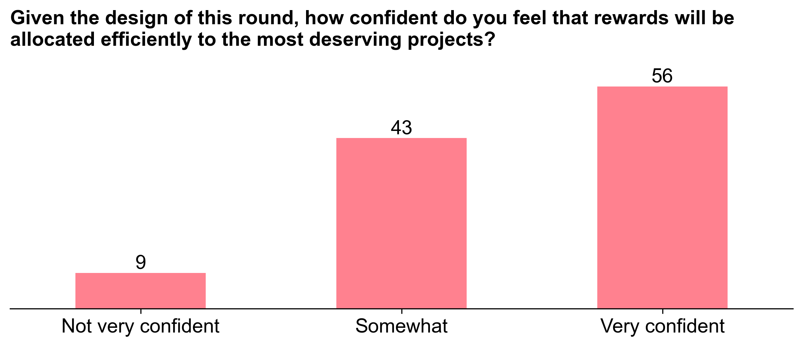

### Absolutes vs percentages

Although the reward function is based on median percentages within each category, voters were also given a preview of an allocation that would result from their project-level votes. For instance, you could yield a value of 400K OP for Project X by making the following selections in your ballot:

- 8M total budget
- 50% to your category
- 10% to Project X

This provides additional context for the outliers in the distribution. Here is a variant on the ballot analyses shown previously, using OP Stack Tooling as an example. This version shows the implied allocation (instead of the percentage of the total pool) that the voter intended to reward the project with. The standard deviation of these absolute values is very high, and virtually every project has at least one vote equating to 200K OP or more.

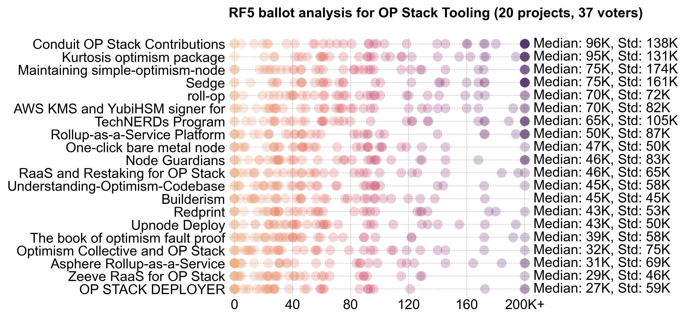

### Pairwise

Some voters chose to use the [Pairwise app](https://gov.optimism.io/t/pairwise-in-retro-funding-5-your-voting-tool/8887) to help prepare their ballots. The pairwise algorithm is a well-known method for ranking items based on pairwise comparisons. We can see from the exhibit below that many of the voters who used the app had a higher CV than those who didn’t. This suggests that Pairwise helped voters develop more nuanced distribution preferences. Or, alternatively, it could be that voters with more nuanced opinions were more likely to use Pairwise. In any case, this is an encouraging sign. It's worth exploring additional applications of Pairwise in future rounds (eg, in eligibility reviews, determining consensus picks, etc).

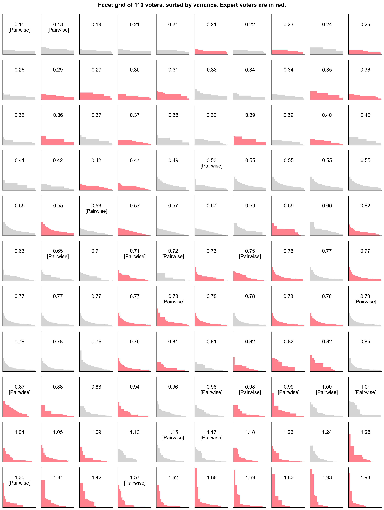

## Conclusion

This is a long post, and yet I feel like I've only scratched the surface of the data here. As always, the scripts for analyzing and visualizing the data are available on [our GitHub](https://github.com/opensource-observer/insights). Unfortunately, the raw voting data is not public in order to preserve voters' anonymity.

If you're interested in forking this, running your own simulations on synthetic data, or an aspiring [impact data scientist](https://docs.opensource.observer/blog/impact-data-scientists), please reach out on [Discord](https://www.opensource.observer/discord). We'd love to collaborate.
