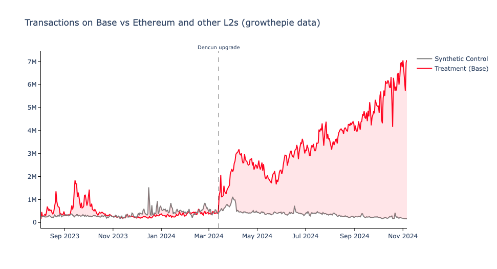
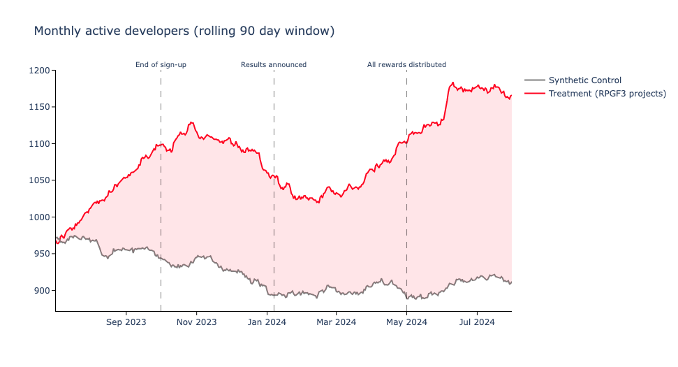

We’ve been thinking a lot about [advanced metrics](https://docs.opensource.observer/blog/war-for-public-goods) lately. We want to get better at measuring how specific types of interventions impact the public goods ecosystem.

For example, we frequently seek to compare the performance of projects or users who received token incentives against those who did not.

However, unlike controlled A/B testing, we’re analyzing a real-world economy. It's impossible to randomize treatment and control groups in a real-world economy.

Instead, we can use advanced statistical methods to estimate the causal effect of treatments on target cohorts while controling for other factors like market conditions, competing incentives, and geopolitical events.

<!-- truncate -->

## Understanding synthetic controls

The [synthetic control method](https://en.wikipedia.org/wiki/Synthetic_control_method) is widely used to assess the effects of interventions in complex systems:

> A synthetic control is a weighted average of several units combined to recreate the trajectory that the outcome of a treated unit would have followed in the absence of the intervention. The weights are selected in a data-driven manner to ensure that the resulting synthetic control closely resembles the treated unit in terms of key predictors of the outcome variable. Unlike difference-in-differences approaches, this method can account for the effects of confounders changing over time, by weighting the control group to better match the treatment group before the intervention.

Economists often use synthetic controls to evaluate policy impacts in non-laboratory settings. For example, [Abadie and Gardeazabal](https://pubs.aeaweb.org/doi/10.1257/000282803321455188) used synthetic controls to estimate the impact of the Basque separatist movement on the region's economy.

At OSO, we'd like to apply these same techniques to network economies to gauge the impact of grants and incentives on outcomes like retained developers, user activity, and network total value locked (TVL).



Another important benefit of synthetic controls is their ability to systematically select comparison groups. In our work, this means comparing grant recipients to similar projects that did not receive funding.

## Using timeseries metrics

Our synthetic control work is part of a broader initiative to build a flexible analysis engine capable of examining almost any metric over time.

For months, we’ve been building a suite of “timeseries metrics.” These models can calculate metrics for any cohort over any timeframe, allowing us to “time travel” and evaluate historical performance. This makes them much more powerful than traditional metrics, which only provide a snapshot of a project’s current state.

Here’s a sample query that retrieves metrics for all OSO collections on available dates:

```sql
select
  t.sample_date,
  m.metric_name,
  c.collection_name,
  t.amount
from timeseries_metrics_by_collection_v0 as t
join metrics_v0 as m
  on t.metric_id = m.metric_id
join collections_v1 as c
  on t.collection_id = c.collection_id
```

Most timeseries metrics are calculated using rolling windows, with daily buckets. For example, instead of simply measuring monthly active developers, we calculate this metric over trailing 30- and 90-day windows, offering a more granular view of cohort performance over time.

## Early findings

With inspiration from [Counterfactual Labs](https://github.com/counterfactual-labs), we’ve used the [pysyncon package](https://sdfordham.github.io/pysyncon/) to estimate treatment effect relative to a synthetic control.

For example, the model below looks at monthly active developers over a 90-day rolling window for a cohort of projects that received Optimism Retro Funding in January 2024. We can compare this cohort to a synthetic control group of similar projects that did not receive Retro Funding.

```python
SynthControlRequest(
    time_predictors_prior_start=datetime(2022, 1, 1),
    time_predictors_prior_end=datetime(2024, 1, 1),
    time_optimize_ssr_start=datetime(2023, 10, 1),
    time_optimize_ssr_end=datetime(2024, 10, 1),
    dependent='active_developers_over_90_day',
    treatment_identifier='op-rpgf3',
    controls_identifier=['ecosystem-x', 'ecosystem-y', 'ecosystem-z'],
    predictors=[
        'new_contributors_over_90_day',
        'commits_over_90_day',
        'issues_opened_over_90_day'
    ]
)
```

The resulting visualization shows the difference in monthly active developers over a 90-day period, with the gap between treatment and synthetic control indicating the treatment effect (about 150-200 monthly active developers on average).



## What's next

As George Box famously said, "all models are wrong, but some are useful."

We are in the early stages of applying advanced metrics like synthetic controls to better measure incentive effects on crypto networks. Stay tuned as we share more findings.

Meanwhile, you can see some examples of the synthetic control models in our [insights repo](https://github.com/opensource-observer/insights/tree/main/analysis/optimism/syncon) and reach out on [Discord](https://www.opensource.observer/discord) if you'd like to collaborate!
