This is the last post in our “opening up the ballot box” series for 2024. Optimism has some changes in the works for [Retro Funding 2025](https://optimism.mirror.xyz/zWlA9LROAzRee5BFqbquYHawmruKzLmXbONp_hcCwE4), which will likely change how we analyze voting behavior in future rounds.

In RF6, our results (as an organization) reflected a critical issue with Retro Funding in its current form: subjective visibility often outweighs measurable, long-term impact.

We had two project submissions:

1. [Insights & Data Science](https://retropgfhub.com/explore/RetroPGF6/OSO-Insights--Data-Science/) (work like this series of posts): awarded 88K OP, the highest of any submission in the round.
2. [Onchain Impact Metrics Infra](https://retropgfhub.com/explore/RetroPGF6/Onchain-Impact-Metrics-for-Retro-Funding/) (open data pipelines for the Superchain): awarded 36K OP, despite being a much larger technical and community effort.

We are humbled by the support for our Insights & Data Science work. Retro Funding has made our work at OSO possible, and we are deeply grateful for this affirmation. But we can’t ignore the underlying signal: the work that is _most visible_-—like reports, frontends, and ad hoc analysis—-tends to receive higher funding than work that delivers deeper, longer-term impact.

<!-- truncate -->

## The broader challenge: incentivizing impact over visibility

Without a consistent framework for evaluating contributions, teams are incentivized to optimize for short-term visibility rather than long-term outcomes.

Consider our own experience:

- In RF3, OSO had only been around for a few months, but focused exclusively on helping badgeholders analyze the very high number of Retro Funding submissions. We received a relatively large allocation (128K OP).
- In RF6, after doubling down on Optimism and delivering significantly more for a broader constituency, our funding decreased in absolute terms (124K OP).

At this point, the game theory optimal strategy for a team like OSO would be to:

- Build a wide range of contributions across multiple categories
- Take a lot of high-floor, low-ceiling bets to maximize expected value

We will not be pursuing this strategy in 2025 😅

Incentiving impact over visibility is a hard problem to solve. But our assumptions are that:

- We won't solve it by expecting voters to put more time into each vote. It's great if some do, but Retro Funding needs to scale.

- We won't solve it by creating a centralized team to come up with their own highly subjective assessments. Expert assessment is a useful input, but this leads to the same gatekeeping and power-brokering that we see in real-world governments.

- We won't solve it by adding comment threads, changing how projects are shuffled, or making other piecemeal improvements to the voting interface. Yes, these are welcome features, but they won't fundamentally change the game.

Our view is that the only way to solve it is by learning how to measure impact.

The long-term success of Retro Funding depends on creating a consistent signal for how impact will be measured and rewarded. Clearer evaluation will motivate the best teams, knowing that their efforts will be recognized based on their actual outcomes—-not just their visibility to voters. We are encouraged to see Optimism taking steps to address this issue in 2025, and will continue to direct our data science efforts towards this goal.

Now let's dive into the ballot data from RF6.

## How the round worked

[RF6](https://gov.optimism.io/t/retro-funding-6-governance-round-details/8870) focused on governance contributions made between October 2023 and September 2024. Projects were organized into three categories:

- **Governance Infrastructure & Tooling**. Technical infrastructure and tools that powered governance processes, including Optimism Governor contracts, voting interfaces, identity systems, and Retro Funding clients.
- **Governance Leadership**. Demonstrated leadership through councils, boards, and commissions, including the Security Council, Grants Council, Developer Advisory Board, and governance process facilitation.
- **Governance Analytics**. Analysis that enabled accountability and transparency, including governance performance reports, grant allocation analytics, and voting power analysis.

Governance councils and commissions were required to submit a single group application per season rather than individual ones.

There were a number of similarities to RF5:

- Categories were strictly enforced. Each voter was randomly assigned a category of 20-30 projects to vote on.
- Badgeholders voted on a total allocation between 1.1M and 3.5M OP, with the final amount set by the median of these votes.
- Badgeholders also voted on how the total budget should be divided across the three categories (eg, 40% / 30% / 30%).
- Guest voters were invited to join the citizens as "badgeholders" for the round.

There were also a few new dynamics as well:

- Impact evaluations. Projects in the Governance Infrastructure & Tooling category could be rated on [Metrics Garden](https://www.metricsgarden.xyz/). The ratings from governance participants were surfaced to voters in the UI.
- Weight of guest voters. Citizens were given the option after the round to vote on how much weight the guest voters should have in the final allocation. (They chose to give them 100% weight.)

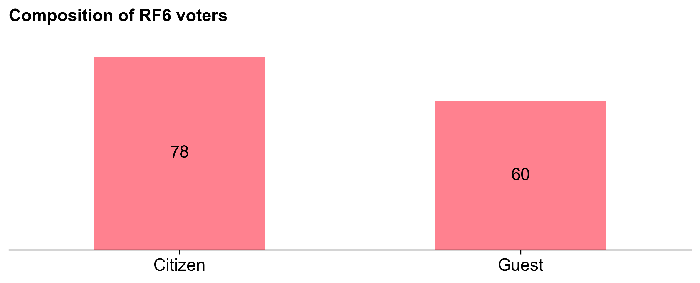

## Voting results

61 out of 138 voters opted for a round allocation of 1-2M OP (closer to the minimum). Only 33 voters opted for the maximum of 3.5M OP. The median value was 2.4M OP.

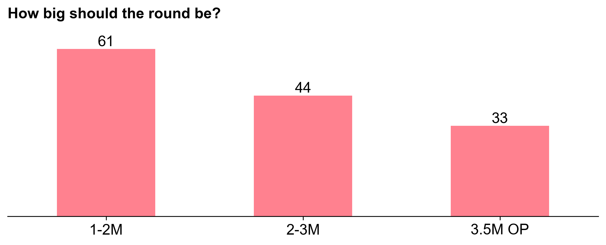

As in RF5, voters were expected to skip any projects they had a conflict of interest with; there were 79 conflicts of interest logged out of 4170 total project votes cast.

After rating projects' impact, voters were given several options for applying a distribution function across their project ratings (e.g., step, linear, pareto, etc.).

Finally, they had the option to refine their allocations project-by-project.

In our [last post](https://docs.opensource.observer/blog/rf5-ballot-box), we covered the distribution curve in detail. The RF5 distribution curve was flatter than previous rounds, despite there being major differences in the size and complexity of the projects being funded.

### The RF6 distribution curve is steeper

The RF6 distribution curve was steeper than RF5. A top 10 percentile project received 2.5X more than an average (median) project.

This is not as steep as the RF4 distribution curve, but is closer to the RF3 distribution curve.

### Most voters did not vote for flat distributions

Unlike the [ballots in RF5](https://docs.opensource.observer/blog/rf5-ballot-box#we-got-flat-distributions-because-thats-what-voters-voted-for), most voters in RF6 did not vote for flat distributions. Citizens tended to vote for steeper distributions than guest voters.

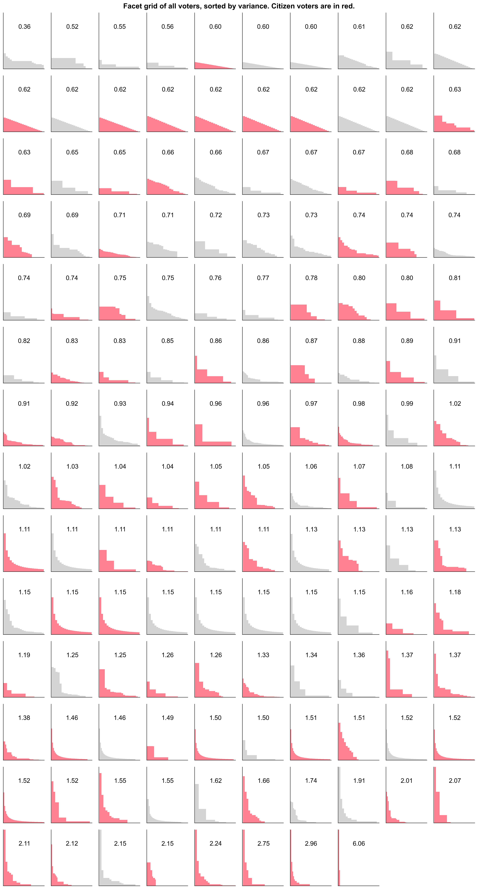

In RF5, there were 35 votes with a [coefficient of variation](https://en.wikipedia.org/wiki/Coefficient_of_variation) (CV) < 0.5 (very flat). In RF6, there was only 1 (from a guest voter).

The default option in the voting UI was a pareto distribution (power law), which may have nudged voters towards casting more aggressive distributions in their ballots.

Only 12% of voters supported all projects in their category (versus 80% in RF5). And more than 50% were willing to allow more than 12.5% to any one project in their category (versus 26% in RF5).

These outcomes are likely due to voters learning from the previous round and also having more spicier takes on which projects they felt deserved to be in the round.

When viewed in aggregate, however, both Citizens and Guests tended to have similar-shaped distribution curves.

While the overall distribution curves are similar, the absolute allocations among projects were very different.

### Citizens and guests had very different project preferences

In RF5, we saw a large difference in preferences between "experts" and "non-experts". However, Guest voters (who were all considered "experts") tended to vote similar to Citizen experts.

In RF6, there was a lot of variance in the project preferences of citizens and guests.

Citizens and guests had very different preferences for the distribution of the budget across categories.

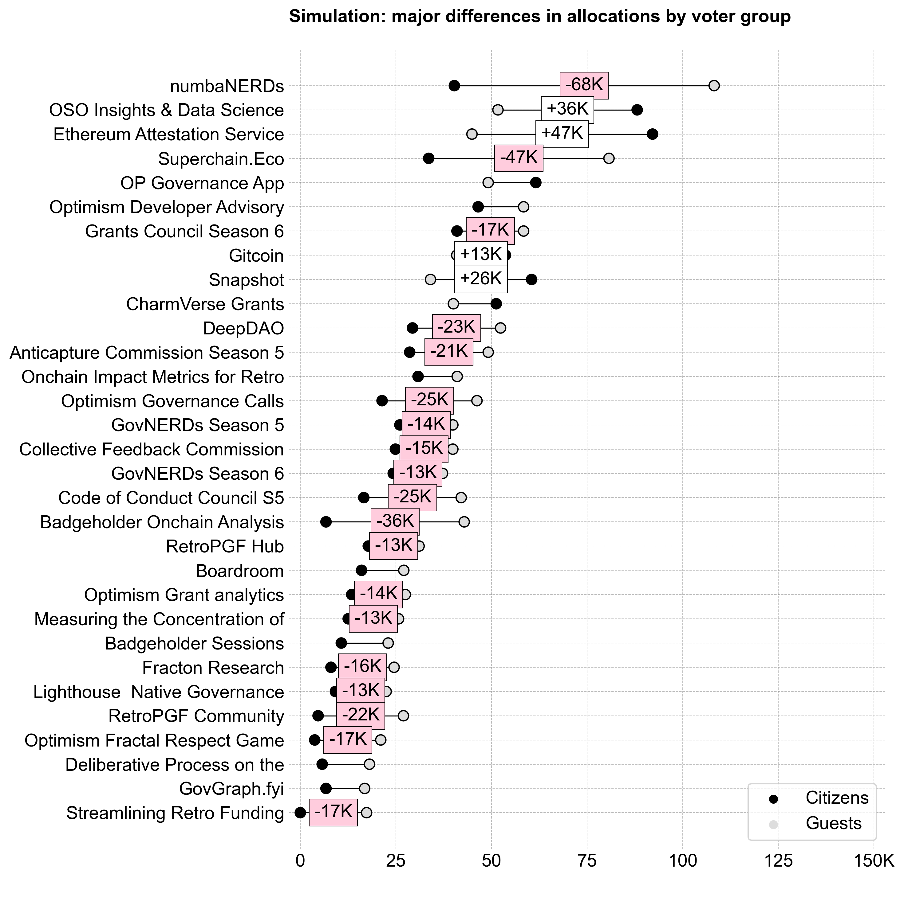

This is not surprising, given that citizens have a front row seat to the work being done by most of the projects in their category.

Overall, Citizens also had a much higher standard deviation in their votes for top projects than Guests. We can see this in the exhibit below, which compares the standard deviation of votes for each project over its median by group. (Only a few projects are labeled for clarity.) It's fitting that OSO ended up in the top right corner of the plot!

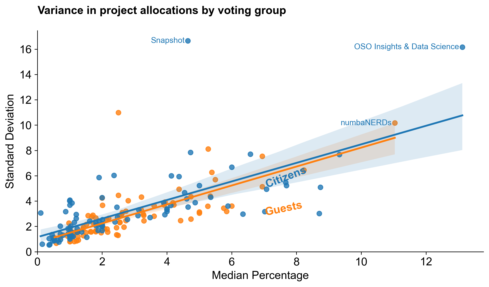

### Key takeaways

- There was less consensus about who the top (and bottom) projects were in this round.
- Citizens and guests had very different opinions about these things.

## Category-level results

The following section breaks down voting patterns and results by category.

### Governance Infrastructure & Tooling

Voters assigned to Governance Infrastructure & Tooling generally allocated less budget to the category than those assigned to the other categories.

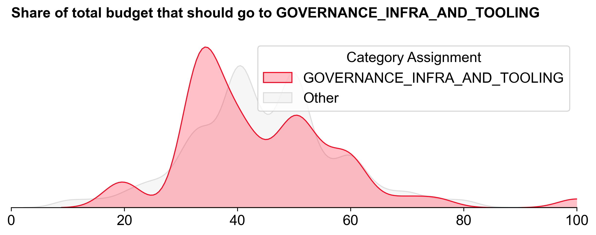

Despite this, Governance Infrastructure & Tooling received the largest share of the budget: 1.005M OP (~41.9%). It also exhibited the steepest distribution curve.

There wasn't much consensus about the top projects in this category, with everyone (except Snapshot) receiving at least one vote of no confidence. Snapshot is undisputedly one of the most popular governance tools in crypto. However, it is ironic that the one consensus pick for this category is a tool that Optimism does not actually use for its token governance. (Snapshot is used for some Citizens' House voting.)

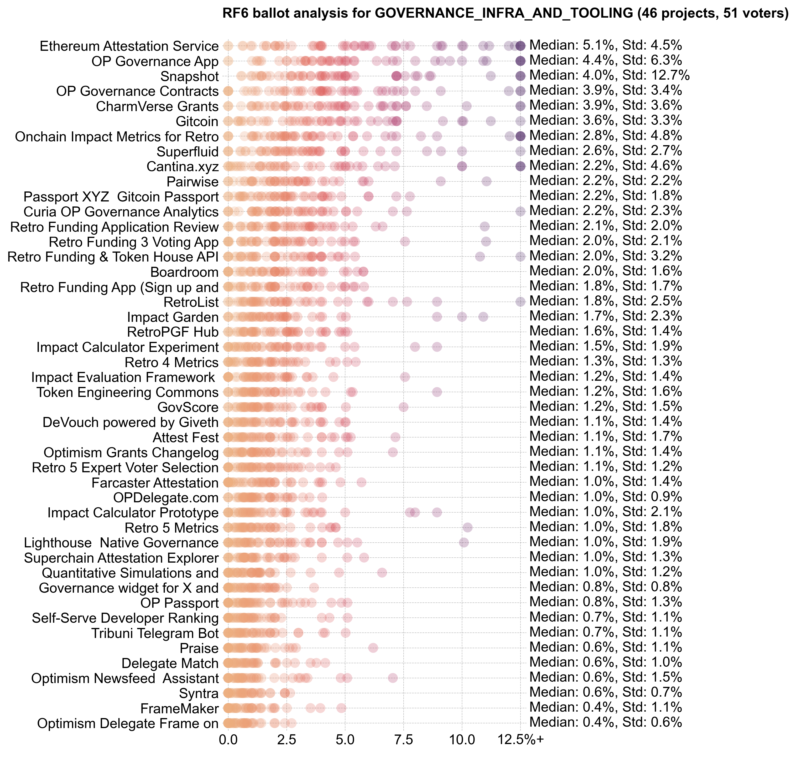

In general, Citizens and Guests had similar preferences across this category.

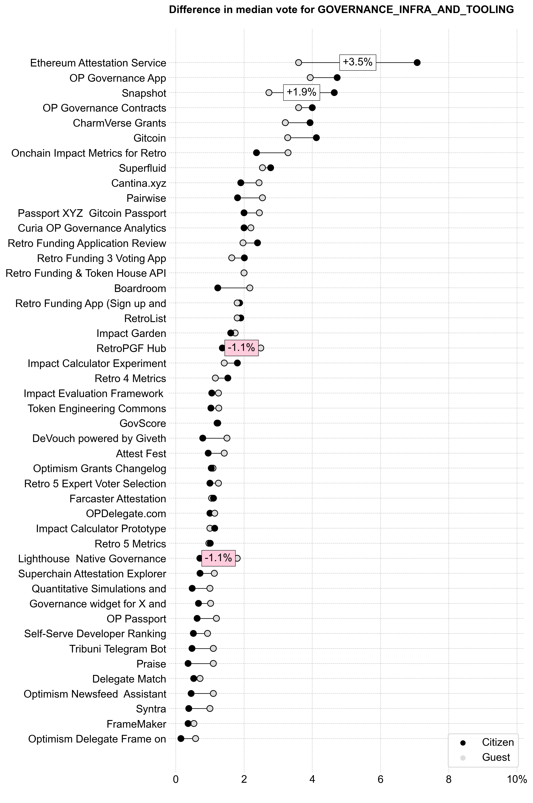

### Governance Leadership

Governance Leadership ranked third overall in terms of funding, with 671K OP (~28%). There was a wide range of opinions about how much budget to allocate to this category.

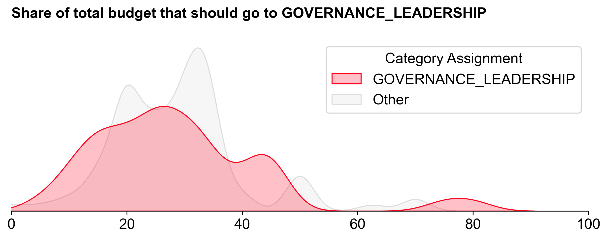

This category had by far the flattest distribution curve of the three.

The main commissions and councils ranked at the top of the distribution, with the Developer Advisory Board, Grants Council, and Security Council receiving the most votes.

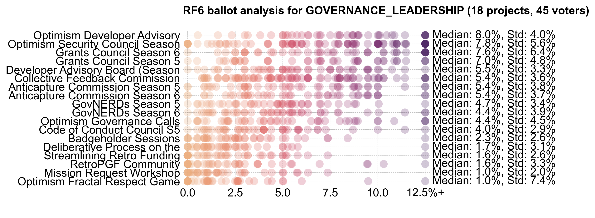

Citizens tended to award more funding for the top commissions and councils, while Guests tended to award more funding for other efforts.

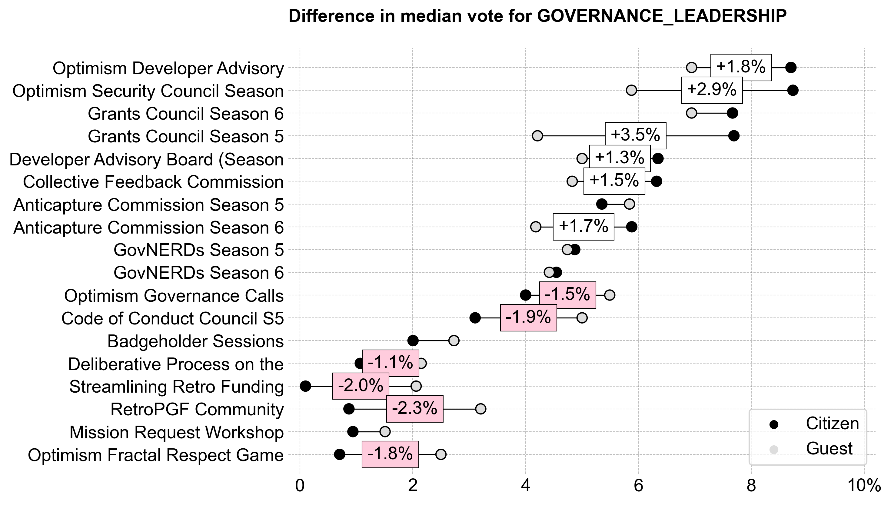

### Governance Analytics

Voters assigned to Governance Analytics had a narrow range of opinions about how much budget to allocate to this category. It received the second largest share of the budget: 724K OP (~30.1%).

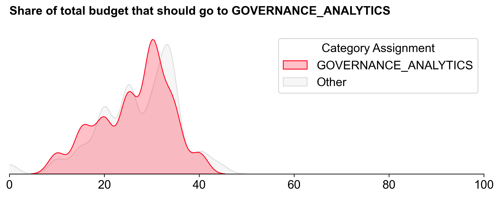

This category had a relatively steep distribution curve and the top projects did better here than in other categories.

There was consensus about the top projects in this category, with the top quartile of projects receiving a large number of votes above 12.5%.

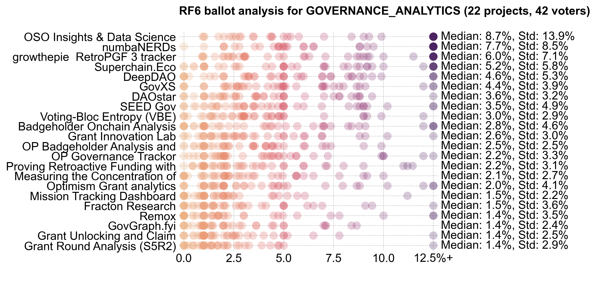

In general, Citizens and Guests had similar preferences across this category. As mentioned earlier, OSO was the statistical outlier between Citizens and Guests.

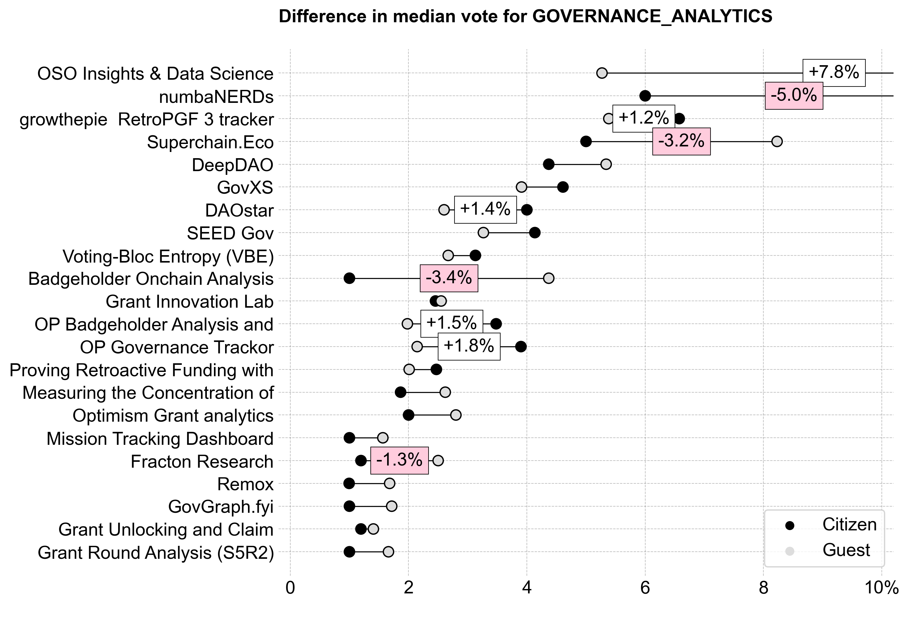

## Conclusion

The scripts for analyzing and visualizing the data are available on [our GitHub](https://github.com/opensource-observer/insights). Unfortunately, the raw voting data is not public in order to preserve voters' anonymity.

If you're interested in forking this, running your own simulations on synthetic data, or an aspiring [impact data scientist](https://docs.opensource.observer/blog/impact-data-scientists), please reach out on [Discord](https://www.opensource.observer/discord). We'd love to collaborate.
