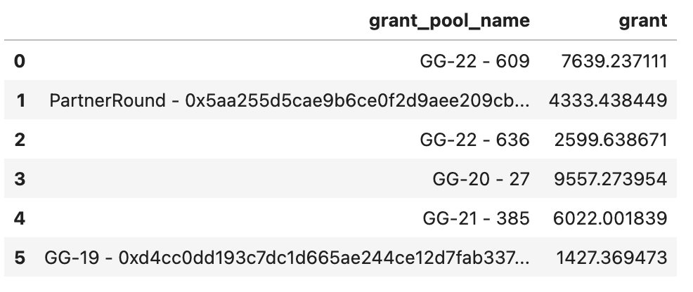
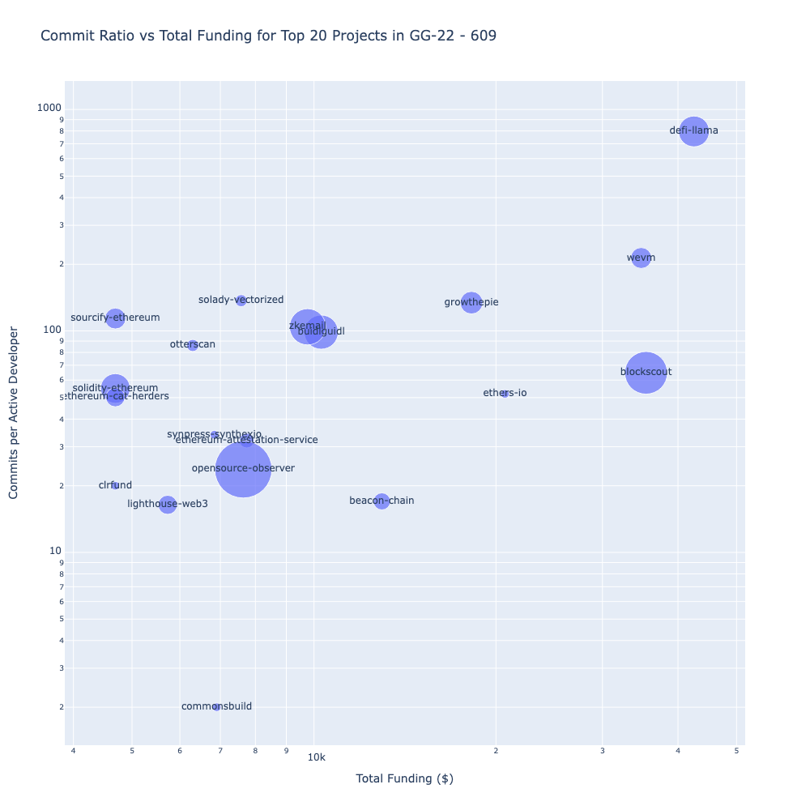
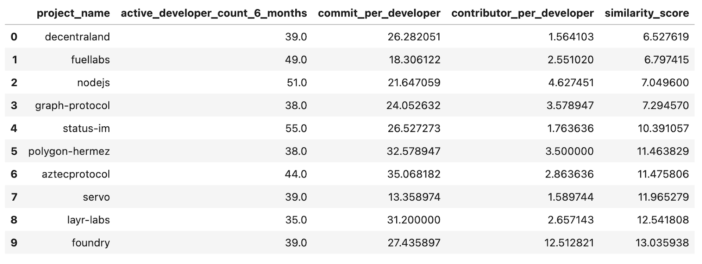
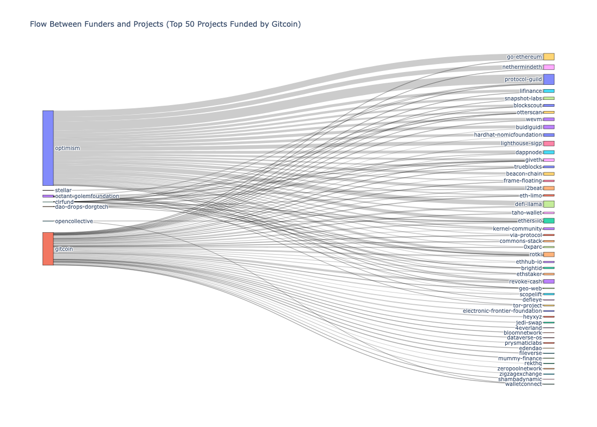

The [Gitcoin grant for Open Source Observer (OSO)](https://gov.gitcoin.co/t/gcp-xxx-oso-gitcoin-collaboration-for-advancing-data-infrastructure-and-gtm-analytics/19578) aims to enhance data infrastructure and analytics capabilities for Gitcoin’s Grants Stack. Leveraging public datasets and advanced metrics, this collaboration seeks to streamline data processes, improve transparency, and enable data-driven decision-making for the Gitcoin ecosystem.  
  
This post shows how you can use OSO to:
- Find and explore Gitcoin grantee (OSS) information in OSO's repository
- Evaluate coding activity, contributions, and productivity to assess project momentum and engagement
- Track funding patterns across rounds, review top-funded projects, and correlate funding with developer activity
- Identify similar grantees with comparable development profiles and discover additional funders supporting Gitcoin grantees

<!-- truncate -->
## Highlights: Key Insights and Analysis
This article summarizes the outcomes of Milestone 1: Alignment on ETL Standards of the grant, highlighting how standardized queries and integrated pipelines effectively link funding data, development activity, and coding metrics. By creating a unified approach to normalizing and processing disparate data sources, the milestone ensures harmonized data outputs, enhances dataset usability, and lays a strong foundation for advanced analytics within Gitcoin’s Grants Stack.

The next phase of the grant focuses on automating project updates, ensuring data synchronization, and developing advanced analytics further to enhance Gitcoin’s grant management and go-to-market strategy.

The following queries showcase how funding data, development activity, and project metrics can be leveraged to gain insights into grantee performance, funding patterns, and collaboration opportunities.

- Find a Gitcoin Grantee: Search for OSS Gitcoin grantees in OSO's repository.

:::info
You can execute these queries on the OSO Data Lake in BigQuery by following the instructions [here](https://docs.opensource.observer/docs/integrate/query-data) or setting up a local [Jupyter Notebook environment](https://docs.opensource.observer/docs/guides/notebooks/jupyter/) and using the tutorial Notebook available [here](https://github.com/opensource-observer/insights/blob/main/community/notebooks/oso_gitcoin_tutorial.ipynb).
:::
### Query 1: Find a Gitcoin Grantee in OSO
You can search if an OSS Gitcoin Grantee's data is available in OSO by using their name as follows:
```python
query = """
    select project_id, project_name, display_name
    from `oso_production.projects_v1`
    where lower(display_name) like lower('%open%source%')
"""
results = client.query(query)
results.to_dataframe()
```
  
The matching records are displayed as follows. You can utilize the field project_name, say “opensource-observer”, for additional information on the grantee, as shown in the following queries.


OSO manages a repository of open source projects, including OSS grantees in Gitcoin, called the [oss-directory](https://github.com/opensource-observer/oss-directory). This repository serves as the foundation of the OSO data pipeline. By running indexers on every artifact linked to projects in the directory, OSO generates metrics that power its API and dashboards, providing valuable insights into project performance and impact.

### Query 2: Query the latest coding metrics for a project
> **Evaluating the latest coding metrics for a project provides critical insights into its development activity, community contributions, and overall momentum in the open source ecosystem.**

After identifying the project in OSO, you can quickly evaluate its recent performance by reviewing its coding metrics for the past six months with the following query:
```python
query = """
    select
      project_name,
      display_name,
      star_count,
      fork_count,
      commit_count_6_months,
      contributor_count_6_months
    from `oso_production.code_metrics_by_project_v1`
    where project_name = 'opensource-observer'
"""
results = client.query(query)
results.to_dataframe()
```


Besides the above metrics, the dataset also allows for analyzing trends in code contributions, issue resolution, community engagement, and project releases. These insights collectively offer a comprehensive view of a project's health and momentum, enabling data-driven evaluations for funding decisions. It’s important to note that developer activity is an input metric rather than the desired impact outcome; however, it offers valuable context for understanding engagement and sustainability. 

### Query 3: Track Project Funding Across Gitcoin Grant Rounds
> **Tracking project funding across Gitcoin Grant rounds offers a clear view of a project's growth trajectory, funding patterns, and its appeal to the community over time.** 

This query aggregates the total funding received by the project in each Gitcoin Grant round.

```python
query = """
    SELECT
      grant_pool_name,
      sum(amount) grant
    FROM `oso_production.oss_funding_v0`
    WHERE to_project_name = 'opensource-observer'
    and from_project_name = 'gitcoin'
    group by grant_pool_name
"""
results = client.query(query)
results.to_dataframe()
```




OSO maintains the oss-funding repository, which houses Gitcoin funding data alongside a curated registry of grants and other funding sources for open source software (OSS) projects. This directory is free to use and distribute as a public good, aiming to support researchers, developers, foundations, and others in gaining deeper insights into the OSS ecosystem.

### Query 4: Explore the Latest Coding Metrics for Top-Funded Projects in a Round
> **Understanding how top-funded projects perform provides valuable insights into their sustainability, community engagement, and potential for long-term impact.**

In this example, you can discover the top 20 funded projects from the GG22 Developer Tooling and Libraries round and gain insights into their development activity. View key metrics such as active developers, commits, issues opened, stars, and forks over the past six months, alongside their total funding in the round.

```python
query = """
    WITH project_funding AS (
      SELECT
        to_project_name,
        SUM(amount) AS total_funding,
        COUNT(DISTINCT event_source) AS funding_sources
      FROM `oso_production.oss_funding_v0`
      WHERE grant_pool_name = 'GG-22 - 609'
      GROUP BY to_project_name
      ORDER BY total_funding DESC
      LIMIT 20
    )
    SELECT
      f.to_project_name,
      f.total_funding,
      f.funding_sources,
      m.active_developer_count_6_months,
      m.commit_count_6_months,
      m.opened_issue_count_6_months,
      m.star_count,
      m.fork_count
    FROM project_funding f
    JOIN `oso_production.code_metrics_by_project_v1` m
      ON f.to_project_name = m.project_name
    ORDER BY f.total_funding DESC;
"""
results = client.query(query)
results.to_dataframe()
```


### Query 5: Normalized Funding Productivity: Commits per Developer vs. Total Funding 
> **Understanding how funding correlates with developer activity helps assess funded projects' engagement and resource utilization.**

Continuing the analysis from the prior example, the following example inspects how funding translates into developer activity for the top 20 projects. 

```python
import plotly.express as px

# Assuming `results_df` is the dataframe containing the query results
results_df = results.to_dataframe()

# Calculate the ratio of commit_count_6_months to active_developer_count_6_months
results_df['commit_ratio'] = results_df['commit_count_6_months'] / results_df['active_developer_count_6_months']

# Create the scatter plot using Plotly with bubble size
fig = px.scatter(
    results_df,
    x='total_funding',
    y='commit_ratio',
    size='active_developer_count_6_months',  # Bubble size
    size_max=50,
    text='to_project_name',
    hover_data=['to_project_name'],
    labels={
        'total_funding': 'Total Funding ($)',
        'commit_ratio': 'Commits per Active Developer',
        'active_developer_count_6_months': 'Active Developers'
    },
    title='Commit Ratio vs Total Funding for Top 20 Projects in GG-22 - 609',
    log_x=True,  # Logarithmic X-axis
    log_y=True   # Logarithmic Y-axis
)

# Update layout for better visualization
fig.update_layout(
    xaxis_title='Total Funding ($)',
    yaxis_title='Commits per Active Developer',
    height=1000,
    width=1000
)

# Show the scatter plot
fig.show()
```

This scatter plot visualizes total funding against the normalized ratio of commits per active developer, with bubble sizes representing the number of active developers. It offers insights into how efficiently teams utilize funding relative to their developer engagement.



### Query 6: Discover grantees with the most similar coding metrics to another project
> **Identifying projects with similar development profiles can uncover potential collaborators, reveal benchmarking opportunities, and highlight successful patterns in the open-source ecosystem.**

This query compares metrics such as active developers, commits per developer, and contributors per developer to find the top 10 projects most similar to Open Source Observer.

```python
query = """
    WITH reference_metrics AS (
        SELECT 
            active_developer_count_6_months AS reference_active_developers,
            commit_count_6_months / active_developer_count_6_months AS reference_commit_per_developer,
            contributor_count_6_months / active_developer_count_6_months AS reference_contributor_per_developer
        FROM `oso_production.code_metrics_by_project_v1`
        WHERE project_name = 'opensource-observer'
    )
    SELECT 
        project_name,
        active_developer_count_6_months,
        commit_count_6_months / active_developer_count_6_months AS commit_per_developer,
        contributor_count_6_months / active_developer_count_6_months AS contributor_per_developer,
        SQRT(
            POWER((commit_count_6_months / active_developer_count_6_months - reference_commit_per_developer), 2) +
            POWER((contributor_count_6_months / active_developer_count_6_months - reference_contributor_per_developer), 2) +
            POWER((active_developer_count_6_months - reference_active_developers), 2)
        ) AS similarity_score
    FROM `oso_production.code_metrics_by_project_v1`, reference_metrics
    WHERE project_name != 'opensource-observer'
      and active_developer_count_6_months > 0
    ORDER BY similarity_score ASC
    LIMIT 10;
"""
results = client.query(query)
results.to_dataframe()
```



### Query 7: Find other funders of the top Gitcoin Grants recipients
> **Understanding the funding relationships for top-supported projects reveals key contributing funders, highlights funding patterns, and provides insights into collaborative networks within the ecosystem.** 

This query identifies the top 50 Gitcoin-funded projects and aggregates their funding amounts, breaking down contributions by funders to showcase the most influential backers and their impact.

```python 
query = """
    WITH top_projects AS (
        -- Select the top 50 projects funded by Gitcoin
        SELECT 
            to_project_name,
            SUM(amount) AS total_funding
        FROM 
            `oso_production.oss_funding_v0`
        WHERE 
            from_project_name = 'gitcoin'
        GROUP BY 
            to_project_name
        ORDER BY 
            total_funding DESC
        LIMIT 50
    )
    SELECT 
        o.to_project_name AS project,
        o.from_project_name AS funder,
        SUM(o.amount) AS funding_amount
    FROM 
        `oso_production.oss_funding_v0` o
    JOIN 
        top_projects t
    ON 
        o.to_project_name = t.to_project_name
    GROUP BY 
        o.from_project_name, o.to_project_name
    ORDER BY 
        project, funding_amount DESC;
"""
results = client.query(query)
results.to_dataframe()
```
Here’s a Sankey diagram created using the outputs of the above query showing the flow of funds for top Gitcoin grantees from other ecosystems, using linked nodes and proportional flow widths to highlight relationships and the magnitude of transfers.



## Conclusion
The collaboration between Open Source Observer (OSO) and Gitcoin is paving the way for a robust data infrastructure and advanced analytics to enhance grant management and decision-making. By leveraging standardized ETL pipelines, integrated datasets, and actionable insights, this initiative empowers Gitcoin’s ecosystem with tools to evaluate grantee performance, track funding patterns, and identify collaboration opportunities.

As the project progresses into the next phase, the focus will be on automating project updates, ensuring data synchronization, and developing advanced analytics further to enhance Gitcoin’s grant management and go-to-market strategy.


