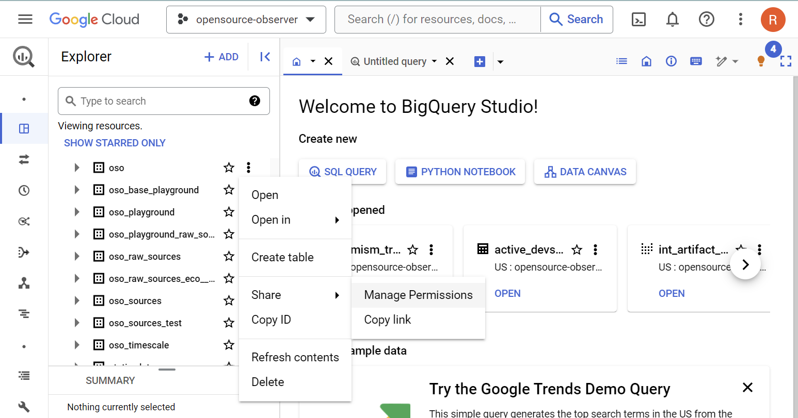
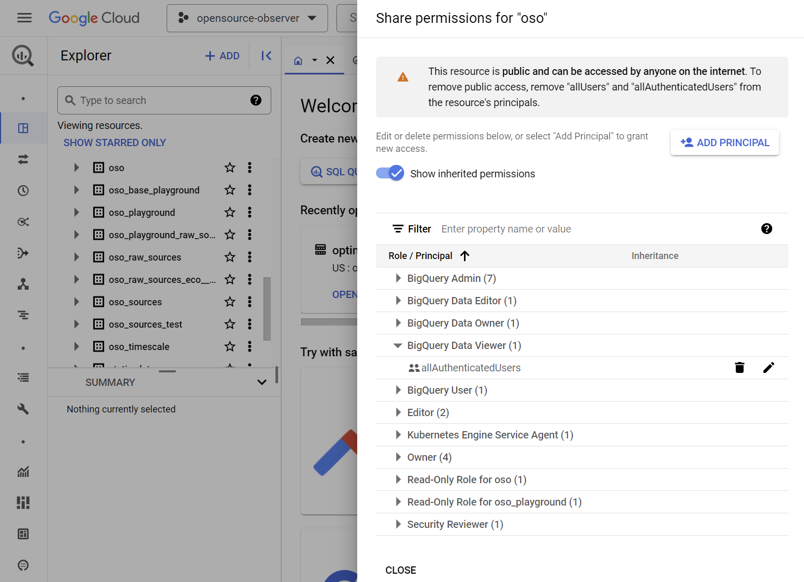

BigQuery's built-in data-sharing capabilities make it
trivially easy to integrate any public dataset into
the OSO data pipeline.

## Make the data available in the US region

In order for our data pipeline to operate on the data,
it must be in the
[US multi-region](https://cloud.google.com/bigquery/docs/locations#multi-regions).

If you have reason to keep the dataset in a different region,
you can use the
[BigQuery Data Transfer Service](https://cloud.google.com/bigquery/docs/dts-introduction)
to easily copy the dataset to the US region.
To manually define this as a transfer job in your own Google project,
you can do this directly from the
[BigQuery Studio](https://console.cloud.google.com/bigquery/transfers?project=opensource-observer).

OSO will also copy certain valuable datasets into the
`opensource-observer` project via Dagster assets.
See the [Dataset replication](#oso-dataset-replication)
section below to add a Dagster asset to OSO.

## Make the data accessible to our Google service account

The easiest way to do this is to make the BigQuery dataset publicly accessible.



Add the `allAuthenticatedUsers` as the "BigQuery Data Viewer"



If you have reasons to keep your dataset private,
you can reach out to us directly on our
[Discord](https://www.opensource.observer/discord).

## Defining a dbt source

For example, Google maintains a
[public dataset](https://cloud.google.com/blog/products/data-analytics/ethereum-bigquery-public-dataset-smart-contract-analytics)
for Ethereum mainnet.

As long as the dataset is publicly available in the US region,
we can create a dbt source in `oso/warehouse/dbt/models/`
(see [source](https://github.com/opensource-observer/oso/blob/main/warehouse/dbt/models/ethereum_sources.yml)):

```yaml
sources:
  - name: ethereum
    database: bigquery-public-data
    schema: crypto_ethereum
    tables:
      - name: transactions
        identifier: transactions
      - name: traces
        identifier: traces
```

We can then reference these tables in a downstream model with
the `source` macro:

```sql
select
  block_timestamp,
  `hash` as transaction_hash,
  from_address,
  receipt_contract_address
from {{ source("ethereum", "transactions") }}
```

## Creating a playground dataset (optional)

If the source table is large, we will want to
extract a subset of the data into a playground dataset
for testing and development.

For example for GitHub event data,
we copy just the last 14 days of data
into a playground dataset, which is used
when the dbt target is set to `playground`
(see [source](https://github.com/opensource-observer/oso/blob/main/warehouse/dbt/models/github_sources.yml)):

```yaml
sources:
  - name: github_archive
    database: |
       opensource-observer
       githubarchive
       invalid_database
      
    schema: |
       oso
       day
       invalid_schema
      
    tables:
      - name: events
        identifier: |
           stg_github__events
           20*
           invalid_table
          
```

### Choosing a playground window size

There is a fine balance between choosing a playground data set window
that is sufficiently small for affordable testing and development,
yet produces meaningful results to detect issues in your queries.

:::warning
Coming soon... This section is a work in progress.
:::

### Copying the playground dataset

:::warning
Coming soon... This section is a work in progress.
:::

## OSO Dataset Replication

In order to make the OSO data pipeline more robust,
we can copy datasets into the `opensource-observer` Google Cloud project.

:::warning
Coming soon... This section is a work in progress.
To track progress, see this
[GitHub issue](https://github.com/opensource-observer/oso/issues/1311).
:::

Dagster also has an excellent tutorial on integrating
[BigQuery with Dagster](https://docs.dagster.io/integrations/bigquery/using-bigquery-with-dagster).
