[Open Source Observer](https://www.opensource.observer/) is a platform for measuring the impact of open source software (OSS) contributions. We launched a few months ago with a commitment to [open source everything](https://docs.opensource.observer/blog/open-source-open-data-open-infra)*.* Here is our [hello world post](https://gov.optimism.io/t/introducing-open-source-observer-measuring-impact-of-oss-contributions-to-the-op-superchain/7071/1) on the forum ICYMI.

This report is a shallow dive on the 300+ open source software projects participating in the latest round of retroactive public goods funding (RetroPGF 3). It combines both off- and onchain data about projects. 

The report itself has two objectives:

- Kickstart more rigorous analysis on the effectiveness of RetroPGF as a mechanism
- Snipe some data nerds to join [this groupchat](https://t.me/oso_rpgf3)

Let’s jump in.

# Who’s included

Over 600 projects and individuals applied for RetroPGF 3. This report only includes the [311 projects](https://www.opensource.observer/explore) that are contributing open source software ***and*** that included links to GitHub repos (plus any OP Mainnet contract addresses) in their applications.

We also have data on projects that applied for previous RetroPGF rounds (but not the current one). A total of 366 OSS projects are represented in the Venn diagram below, of which 205 have no prior experience with RetroPGF.

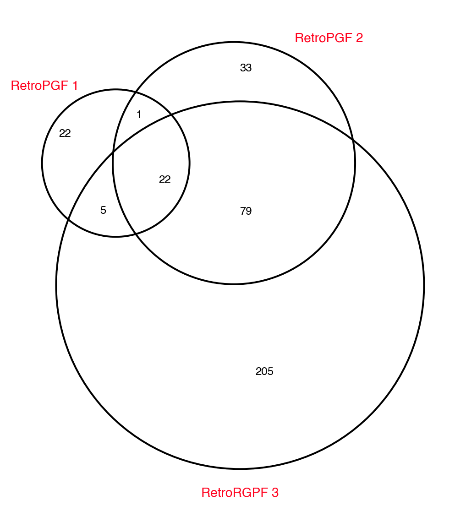

These projects have lots of shared contributors too — a theme will explore further later on in this doc!

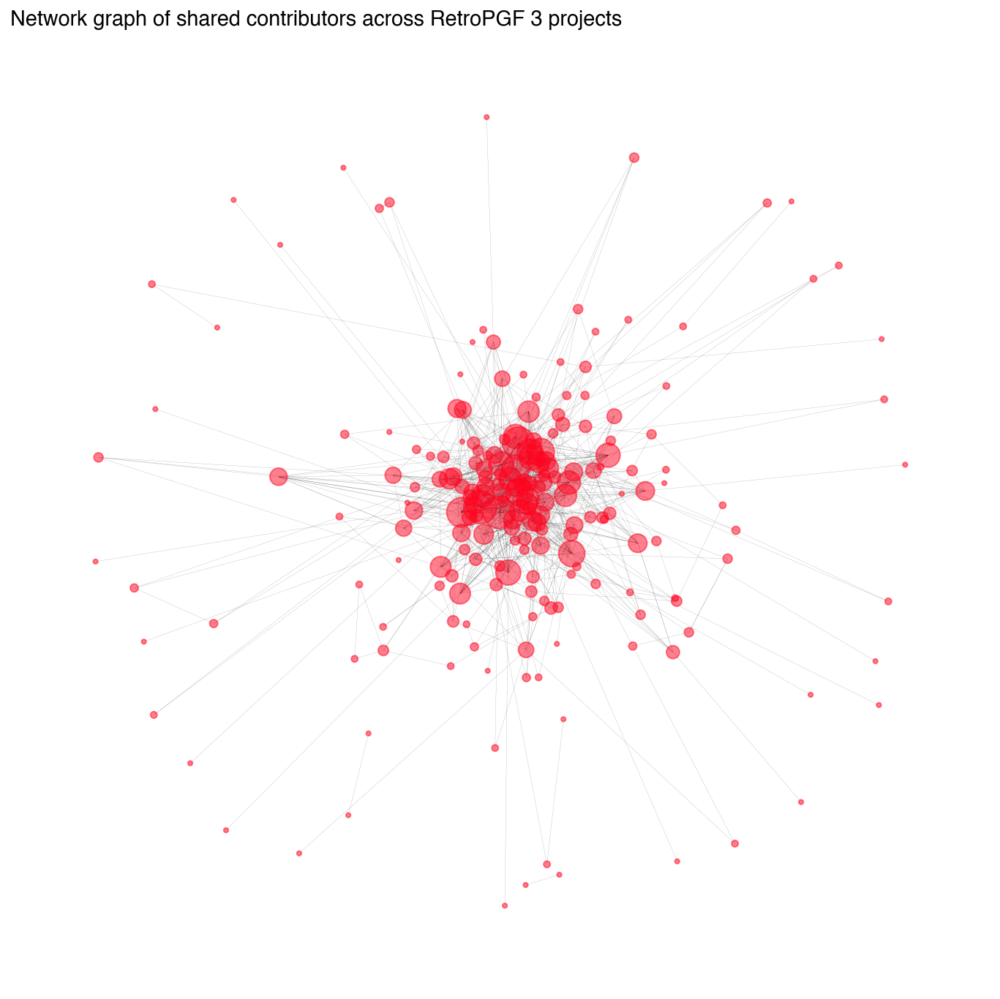

# Developer activity before and after RetroPGF

There are a number of places to find aggregate or project-specific GitHub activity metrics, but we think it’s interesting to look at cohorts of projects over specific time periods.

Among the RetroPGF 3 cohort, we can see this number hovering between 500-600 developers around the time of RetroPGF2 (March 2023), and, general, up sharply from late 2021, when the first RetroPGF occurred. 

(Note: we are not implying that RetroPGF produced these developer activity numbers. Macro trends have probably been far more important. We’re just providing these dates for context.)

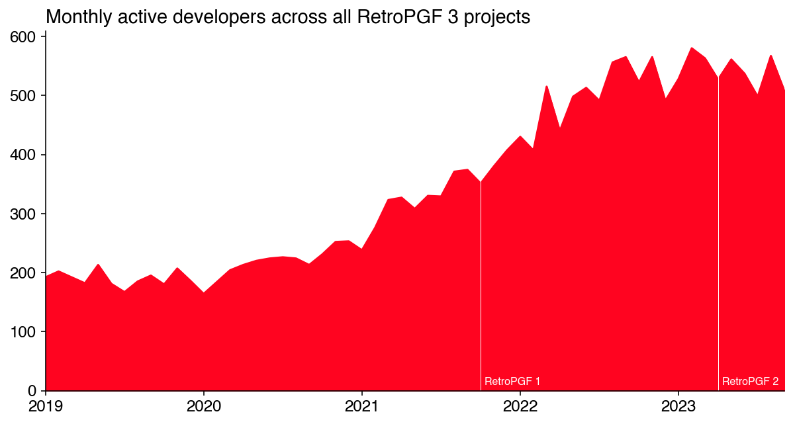

We’ve defined a “monthly active developer” in the same way as [Developer Report](https://www.developerreport.com/), ie, anyone who has committed code on at least 10 days in a given month to a project (excluding bots and forks). 

We can also do some light cohort analysis to compare growth among projects that also received funding from RetroPGF 2 versus those that only applied for RetroPGF3.

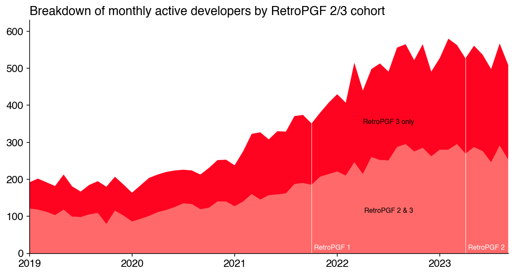

As expected, the cohort that received funding from both RetroPGF 2 & 3 rounds has generally been around for longer. Both cohorts, however, exhibit high growth during 2021-2022 and relative stability during 2023.

We can extend this further to include ***all*** OSS projects that have participated in RetroPGF at some point in their history. 

The cohort of 55 projects that participated in RetroPGF 1 or 2 but did not participate in RetroPGF 3 represents a fairly small share of the overall mix but includes well-known (and still very active) projects like [code4rena](https://www.opensource.observer/project/code-423n4), [Safe](https://www.opensource.observer/project/safe-global), and [Wallet Connect](https://www.opensource.observer/project/walletconnect).

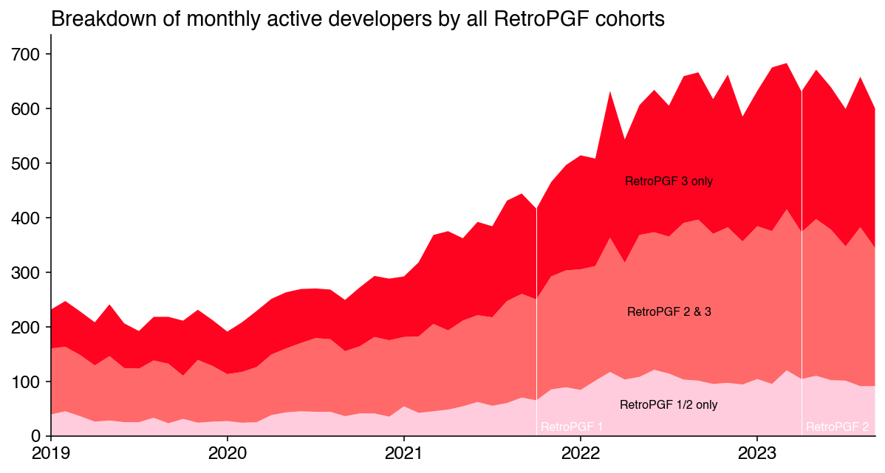

Finally, we can see some high level trends regarding the change in developer activity across RetroPGF 2 projects before and after RetroPGF. The vast majority of projects maintained the same level of activity post-RetroPGF 2 as they had pre-RetroPGF 2. Given the sector has been in a bear market, it would be interesting to compare these trends to other ecosystems.

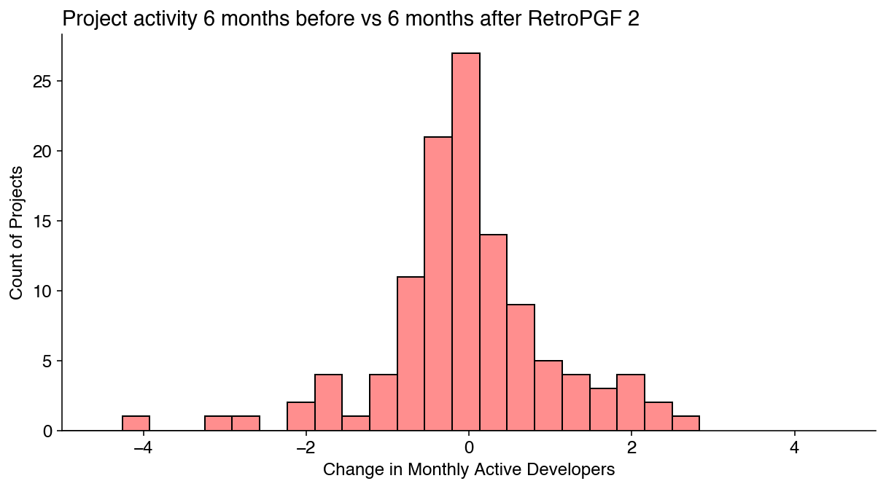

If all of these projects were committing to the same GitHub, here’s what it would look like. It’s no surprise to see [Protocol Guild](https://www.opensource.observer/project/protocol-guild) at the top of the list with a large network of active developers, but don’t sleep on [IPFS](https://www.opensource.observer/project/ipfs) or [Synthetix](https://www.opensource.observer/project/synthetix) either. 

# Projects with onchain contributions

A total of 86 of 296 OSS *projects* (not individuals) participating in RetroPGF 3 included contracts deployed on OP Mainnet in their application. There were a total of 1.4M unique users across all of these projects over the past two years.

Here’s the same type of heatmap we saw above, now applied to projects’ active onchain users. A dark red box signifies a month where a project had more than 1000 users making transactions.

Only a few projects such as [Velodrome](https://www.opensource.observer/project/velodrome) have been able to sustain high levels of onchain activity since their launch on OP a year ago.

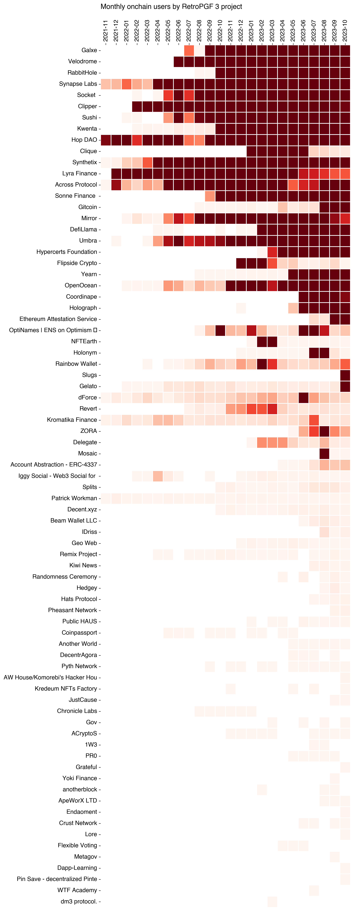

We can also analyze user profiles across these different projects. Of the 1.4M total users shared among these projects, around 400K interacted with at least three projects. About 40K are what I’ve called ”high value active users” who have done something onchain in the past 90 days and have made more than 30 onchain transactions total. 

We can plot these two dimensions for all of the onchain projects participating in RetroPGF 3. While projects like [Galxe](https://www.opensource.observer/project/galxe), [Rabbithole](https://www.opensource.observer/project/rabbithole), [Synapse](https://www.opensource.observer/project/synapse), and [Velodrome](https://www.opensource.observer/project/velodrome) stand out for having very large numbers of users in general, projects such as Clipper (by [Shipyard](https://www.opensource.observer/project/shipyard-software)), [Kwenta](https://www.opensource.observer/project/kwenta), and [Lyra](https://www.opensource.observer/project/lyra-finance) are notable for having had a large share of users who both use a variety of dapps and are high value actives.

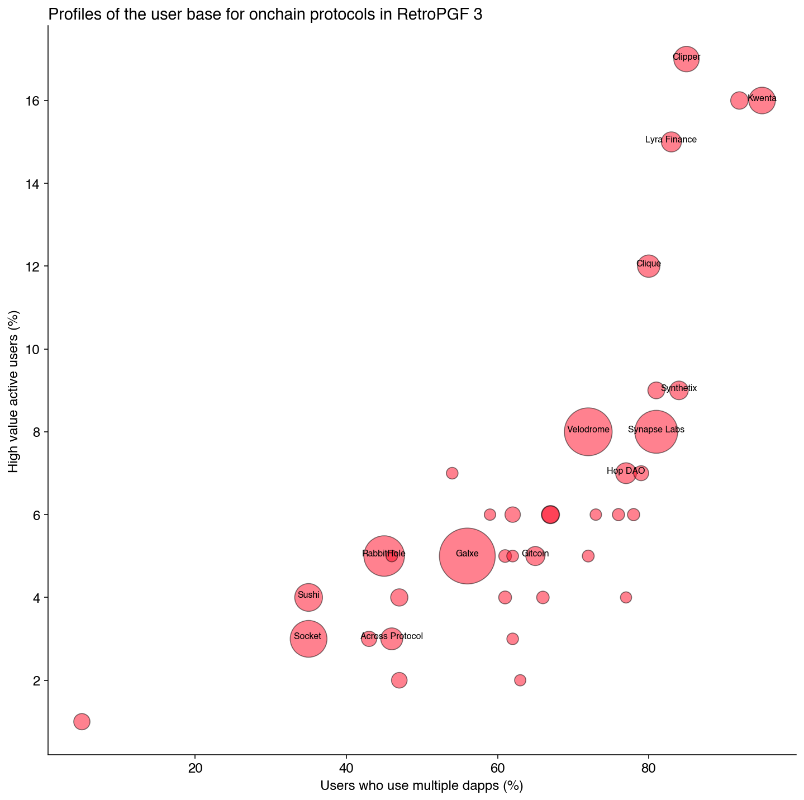

We can also try to attribute impact to protocols that onboarded new users to OP Mainnet who would go on to be active onchain users. Of the 40K high value active users identified above, here’s a breakdown of the first dapps (from the RetroPGF 3 cohort) they interacted with on OP. It’s notable to see that [Synapse](https://www.opensource.observer/project/synapse) (a cross-chain communications protocol) really stands out here.

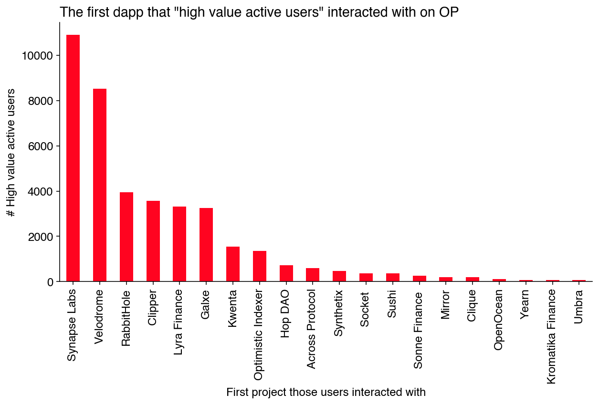

# Measuring sequencer fee impact

One of the most straightforward ways of measuring a project’s impact on OP Mainnet is to calculate its sequencer fees. The protocols participating RetroPGF 3 have generated a combined 148 ETH in Layer 2 sequencer fees. This is actually quite small in comparison to ***all*** activity on OP Mainnet. We’ve indexed transaction data from another ~150 projects with high levels of onchain activity on OP Mainnet and those have contributed 894 ETH at the time of writing.

The treemap below shows both cohorts and the most active contributors in terms of sequencer fees. [Perpetual Protocol](https://www.opensource.observer/project/perpetual-protocol) has the largest contribution in our dataset of all projects on OP Mainnet.

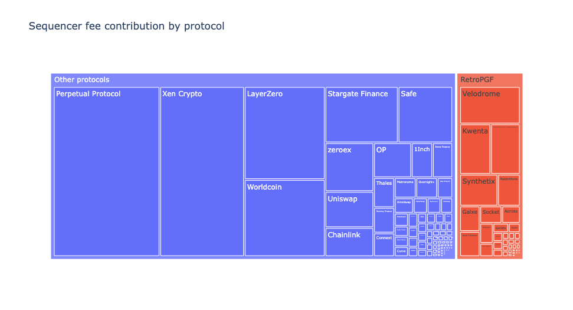

If we just zoom in on the RetroPGF 3 portion, here’s what it looks like. [Infinitism (ERC-4337) - Account Abstraction](https://www.opensource.observer/project/eth-infinitism-account-abstraction) is an important case study because its primary users are other projects providing account abstraction services, not individuals. 

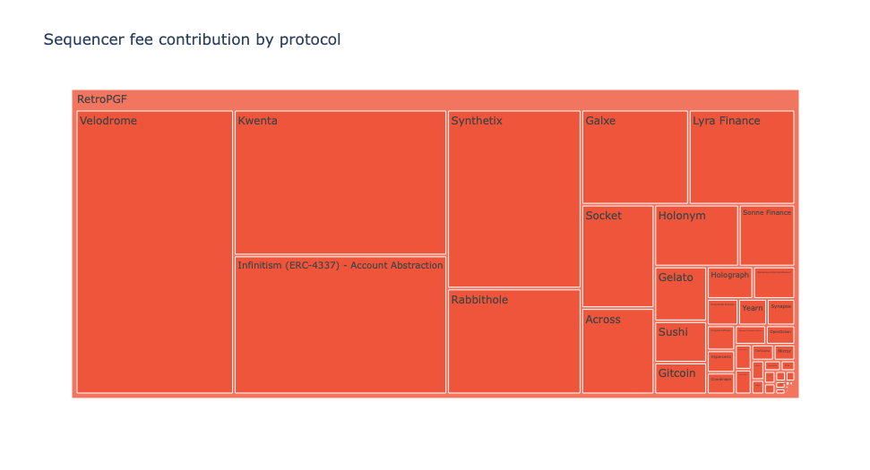

It’s also important to look upstream of these protocols and capture the impact of the libraries and projects they depend on, which make it easy to deploy or improve UX.

Our first attempt at this is something we call “downstream impact” — a way of tracing the impact of certain libraries, clients, etc on sequencer fees. We do this by looking at the dependency tree of onchain projects and identify the offchain projects they depend on.

Our first version looks solely at package data from npm, a small slice of the actual dependency graph among projects. For instance, [ethers.js](https://www.opensource.observer/project/ethers-io) and [web3.js](https://www.opensource.observer/project/web3) are two very popular npm packages in the dependency graph of other onchain projects.

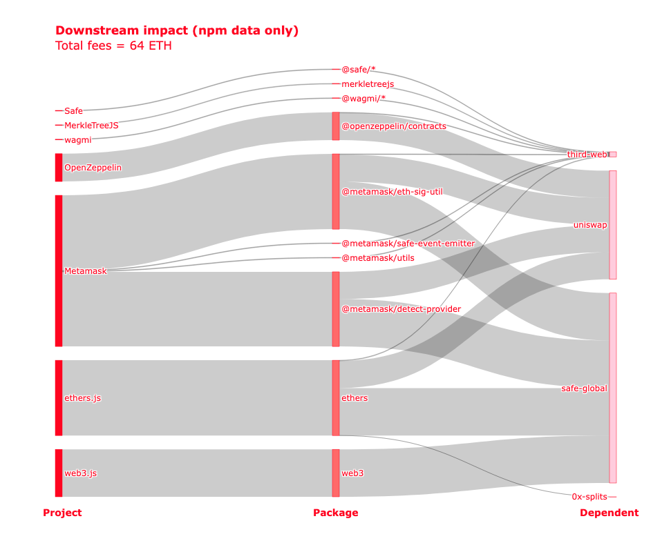

Soon, we hope to be able to surface the downstream impact via a far more robust graph.

# Finding hidden gems

Now that we have these graphs, we can start doing other cool things, like curating lists of projects that have contributed to different forms of impact, and surfacing new insights.

For instance, if we run a network graph across the GitHub contributors in the Optimism community, there’s potential to identify projects that have had outsized impact but previously flown under the radar, such as [libp2p](https://www.opensource.observer/project/libp2p) and [Tenderly](https://www.opensource.observer/project/tenderly). 

The graph below shows teams with high network centrality participating in RetroPGF 3.

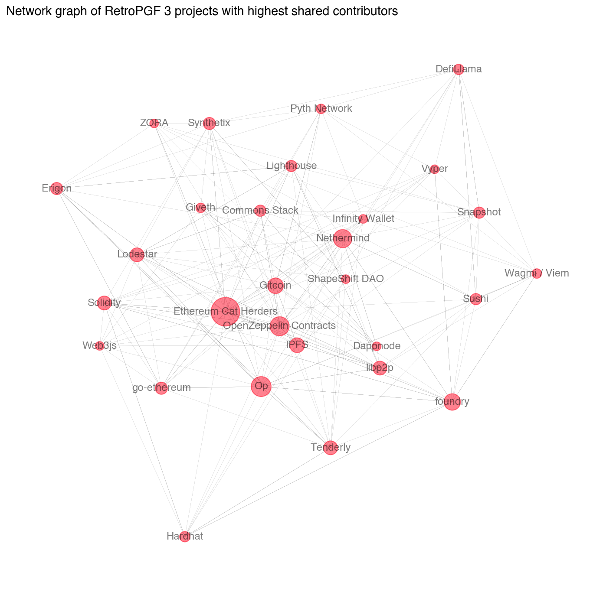

We can also identify individuals that have played an outsized role in contributing to multiple projects in the Optimism ecosystem. Here’s a list of the top 150 contributors across all RetroPGF 3 projects since 2019, based on commits and PRs. Individuals like tjayrush ([TrueBlocks](https://www.opensource.observer/project/trueblocks)) and lefterisjp ([rotki](https://www.opensource.observer/project/rotki)) have a tremendous history of consistency not only on their own projects but across the ecosystem. 

# Avoiding Goodhart’s Law

The hope is that this kind of data can take what has previously been an almost entirely qualitative process and turn it into one where humans have some data in the loop.

Of course, there is a risk that any metric that starts to be heavily relied upon by funders could be easy to game. And then, per Goodhart’s Law, it ceases to be a good metric.

Plurality is the best antidote for this: we need both a multitude of impact metrics and a multitude of communities assigning weight to those metrics based on different values sets. That’s why [we need you](https://t.me/osocommunity), anon.

It’s unlikely that there is much low-hanging fruit to pick here. We can agree that things like GitHub stars and the number of unique addresses that have interacted with a protocol are not great metrics.

But that shouldn’t prevent us from seeking out and experimenting with other metrics, particularly “ecosystem-level” metrics, which seek to measure a project’s relative impact within a network of projects, or “derivative” metrics, which combine two metrics from different sources.

You can see my dataviz notebook [here](https://github.com/opensource-observer/insights/blob/main/notebooks/2023-11-16_OptimismEcosystemAnalysis.ipynb).

If you’re a data nerd who wants to contribute to this effort, please join [this groupchat](https://t.me/osocommunity) and tell us what you’re up to!

Stay optimistic!