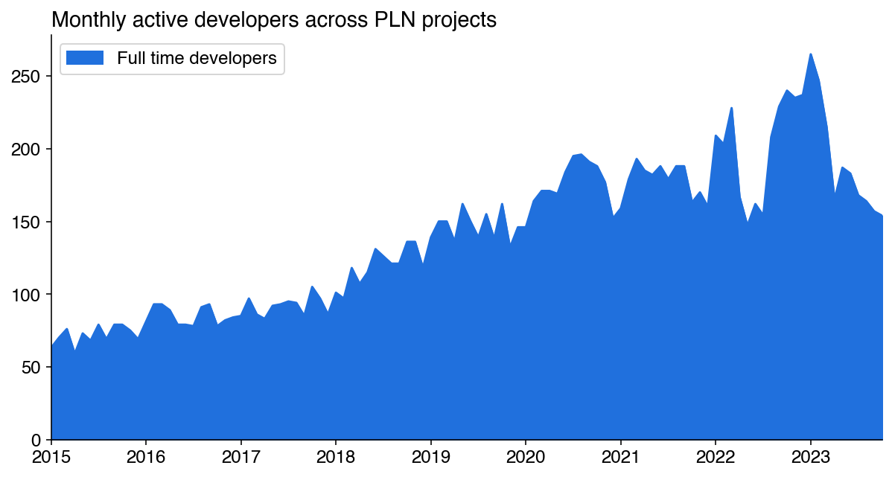
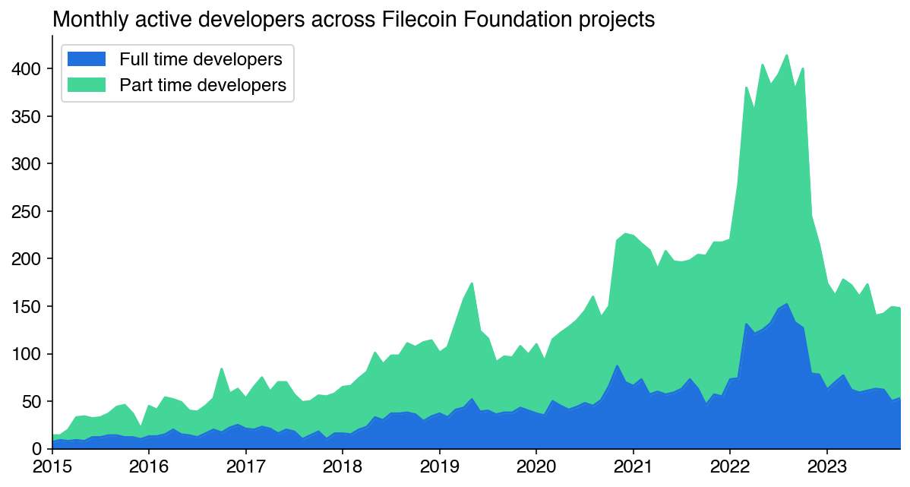
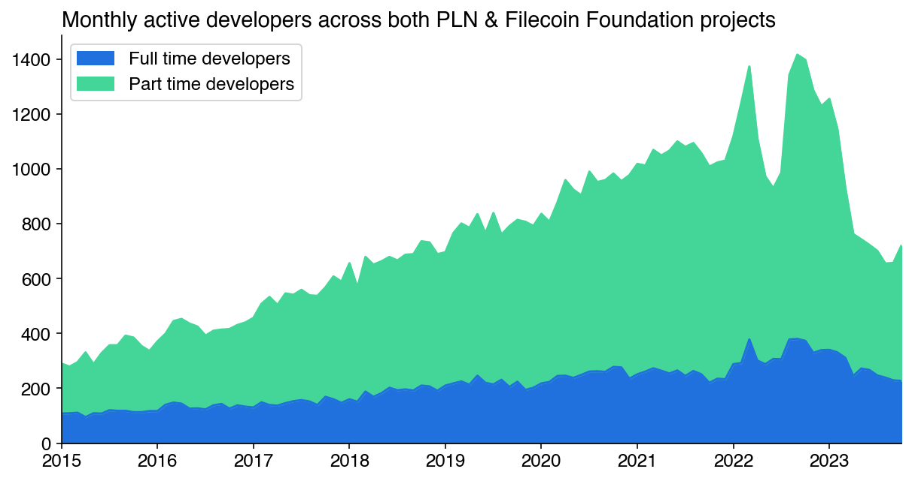
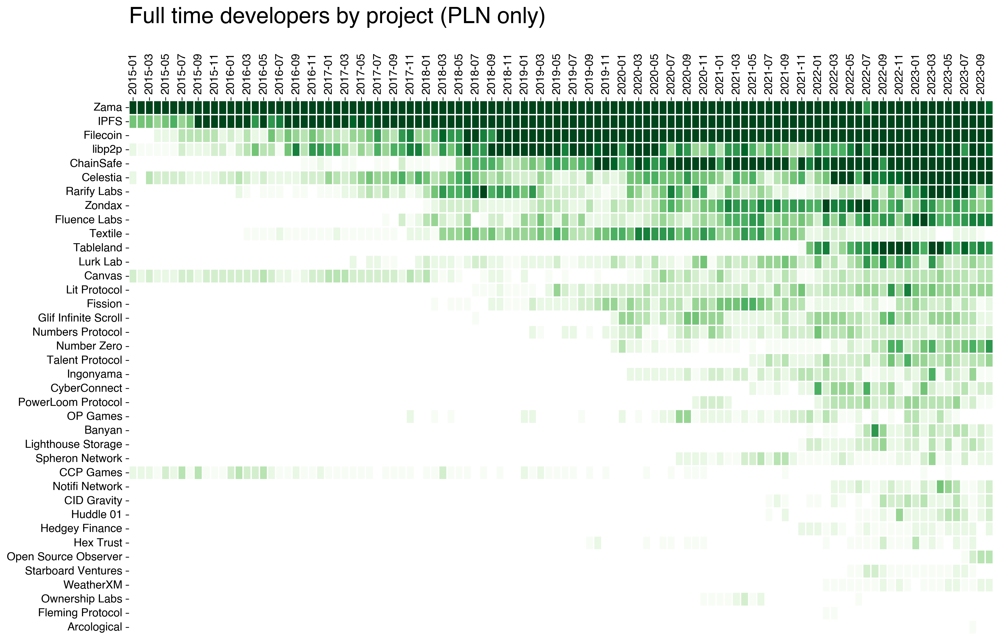
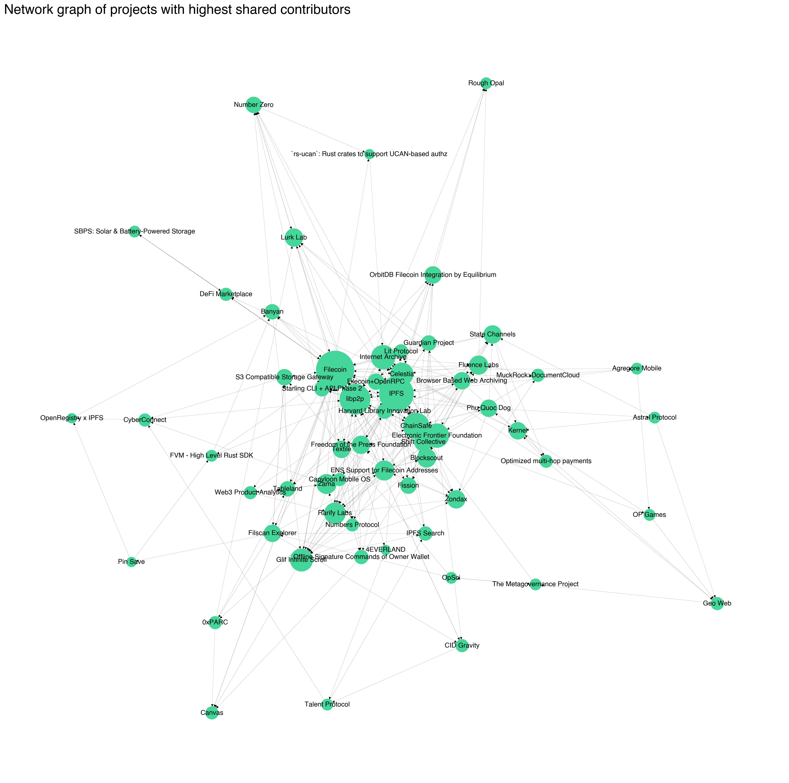

[Open Source Observer](https://www.opensource.observer/) is a platform for measuring the impact of open source software (OSS) contributions. We launched a few months ago with a commitment to [open source everything](https://docs.opensource.observer/blog/open-source-open-data-open-infra). We attended the PL Summit in Istanbul last month and had a chance to present our work to the community. We are excited to announce that we are now initiating coverage of the PLN open source economy.

This report is a shallow dive on 188 open source software projects that we are currently tracking within the PLN ecosystem. We are also tracking 1,000+ projects in the broader crypto economy, which we will cover in seperate reports. 

The projects included here are just a subset of the PLN. We received a database dump from the Filecoin Foundation and a shortlist of projects that were attending the PL Summit. We will be doing a big push to onboard more projects in early 2024. If you are a PLN project that would like to be included, please submit a PR to our [oss-directory](https://github.com/opensource-observer/oss-directory) repo!

You can learn about any of the projects in this report by searching for it [here](https://www.opensource.observer).

# Who’s included

One of the first questions we wanted to explore is how many of these projects are unique to the PLN. We found that the vast majority of projects that have received funding from the Filecoin Foundation or the PLN are focused on building here. We checked for membership with Gitcoin Grants and Optimism RetroPGF, two other major funding sources for OSS projects in the crypto economy. There was also very little apparent overlap between projects in the PLN and those that have received grants from the Filecoin Foundation.

These projects have lots of shared contributors too — a theme will explore further later on in this doc!

# Developer activity since 2015

There are a number of places to find aggregate or project-specific GitHub activity metrics, but we think it’s interesting to look at cohorts of projects and developer types over specific time periods.

Among developers working full-time on PLN projects, we can see a steady increase from 2015 all the way through 2023. Currently, there are at least 150 full-time developers contributing to PLN projects, down from a peak of over 200 at the start of 2023.

We’ve defined a "full-time developer” in the same way as [Developer Report](https://www.developerreport.com/), ie, anyone who has committed code on at least 10 days in a given month to a project (excluding bots and forks). 

If we also factor in part-time developers (anyone who has committed code at least once in a given month), then there is much more volatility, especially in recent years. There are currently over 600 part-time developers, down from a peak of nearly 1400 in last 2022. This appears to be driven by changes in the contribution patterns for a small number of projects that had large numbers of part-time developers, so take these numbers with a grain of salt.

Now, let's take a look at projects that have received grants from the Filecoin Foundation. These tend to be smaller projects, many of which began appeared to have gotten their start in the bull run of 2021. There's a large surge of activity in 2022, and then numbers fall back to pre-2021 levels. It's interesting to note that the ratio of full-time to part-time developers is much higher for these projects (around 1:1) than for the broader PLN (around 1:3).

Finally, if we combine the two cohorts we see a total of 719 active developers (227 full-time and 492 part-time) as of last month. These are robust numbers for a large decentralized ecosystem!

If all of the projects in the PLN were committing to the same GitHub, here’s what it would look like. It’s no surprise to see [IPFS](https://www.opensource.observer/project/ipfs), [Filecoin](https://www.opensource.observer/project/filecoin-project), and [libp2p](https://www.opensource.observer/project/libp2p) with many active developers, but [Zama](https://www.opensource.observer/project/zama-ai) and [ChainSafe](https://www.opensource.observer/project/chainsafe) are major contributors too. 

We can extend this analysis to include Filecoin Foundation grant recipients too. Although there's a long tail of projects that seemed to go quiet in 2023, Filecoin Foundation has also provided critical support to groups like the [Freedom of the Press Foundation](https://www.opensource.observer/project/freedom-of-the-press-foundation), [Internet Archive](https://www.opensource.observer/project/internet-archive), [Electric Frontier Foundation](https://www.opensource.observer/project/electronic-frontier-foundation), and the [Harvard Library Innovation Lab](https://www.opensource.observer/project/harvard-library-innovation-lab).

# Finding the central nodes

Now that we have these graphs, we can start doing other cool things, like curating lists of projects that have contributed to different forms of impact, and surfacing new insights.

For instance, if we run a network graph across the GitHub contributors in the PLN and Filecoin Foundation community, we can identify some of the more central projects in the ecosystem with lots of shared contributors. The overlap among Celestia, Filecoin, and libp2p communities appears particularly dense.

We can also identify individuals that have played an outsized role in contributing to projects throughout the ecosystem. Here’s a list of the top 150 contributors across all projects since 2015, based on commits and PRs. Individuals like stebalien, n8fr8, and dignifiedquire have a tremendous history of consistency, whereas others like jbenet appear to have a rage coding fit every year or so.

# What's next?

This was just a small taste of what we can do with the data we’re collecting. We’re excited to continue building out our data analytics platform and sharing more insights with the community.

You can see dataviz notebook like this [here](https://github.com/opensource-observer/insights/).

If you’re a data nerd who wants to contribute to this effort, please join [this groupchat](https://t.me/osocommunity) and tell us what you’re up to!