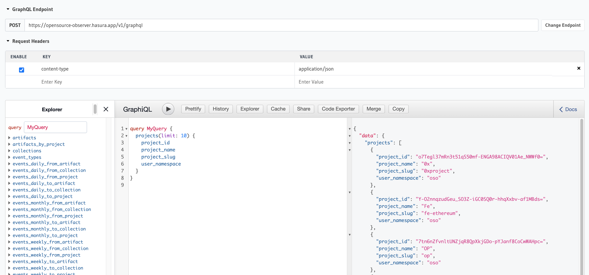

The OSO API currently only allows read-only GraphQL queries.
This API should only be used to fetch data to integrate into a live application.
If you need to perform data science over a large dataset, see the guides on
[using the data warehouse](../warehouse)
and [downloading static data](../fetch-data).

## GraphQL Endpoint

All API requests are sent to the following URL:

```
https://opensource-observer.hasura.app/v1/graphql
```

## Authentication

In order to authenticate with the API service, you have to use the `Authorization` HTTP header and `Bearer` authentication on all HTTP requests, like so:

```js
const headers = {
  Authorization: `Bearer ${DEVELOPER_API_KEY}`,
};
```

See the Getting Started guide on how to get your developer API key.

:::tip
Our API opens a small rate limit for anonymous queries without authentication. Feel free to use for low volume queries.
:::

## Example

This query will fetch the first 10 projects in OSS Directory.

```graphql
query GetProjects {
  projects(limit: 10) {
    project_id
    project_name
    project_slug
    user_namespace
  }
}
```

## GraphQL Explorer

The GraphQL schema is automatically generated from [`oso/dbt/models/marts`](https://github.com/opensource-observer/oso/tree/main/dbt/models/marts). Any dbt model defined there will automatically be exported to our GraphQL API. See the guide on [adding DBT models](../../contribute/adding-dbt-models.md) for more information on contributing to our marts models.

:::warning
Our data pipeline is under heavy development and all table schemas are subject to change until we introduce versioning to marts models.
Please join us on [Discord](https://www.opensource.observer/discord) to stay up to date on updates.
:::

You can navigate to our [public GraphQL explorer](https://cloud.hasura.io/public/graphiql?endpoint=https://opensource-observer.hasura.app/v1/graphql) to explore the schema and execute test queries.



## Rate limiting

All requests are rate limited. There are currently 2 separate rate limits for different resources:

- **anonymous**: Anyone can make a query, even without an authorization token, subject to a low rate limit.
- **developer**: Developers who have been accepted into the [Kariba Data Collective](https://www.kariba.network) and provide an API key in the HTTP header will be subject to a higher rate limit.

:::warning
We are still currently adjusting our rate limits based on capacity and demand. If you feel like your rate limit is too low, please reach out to us on our [Discord](https://www.opensource.observer/discord).
:::
